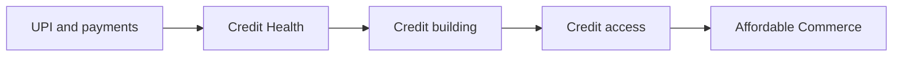
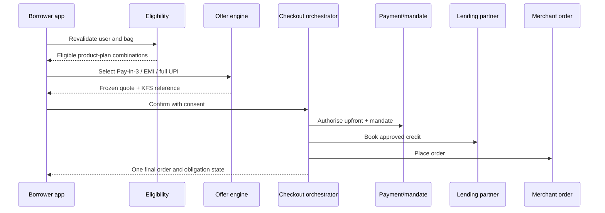
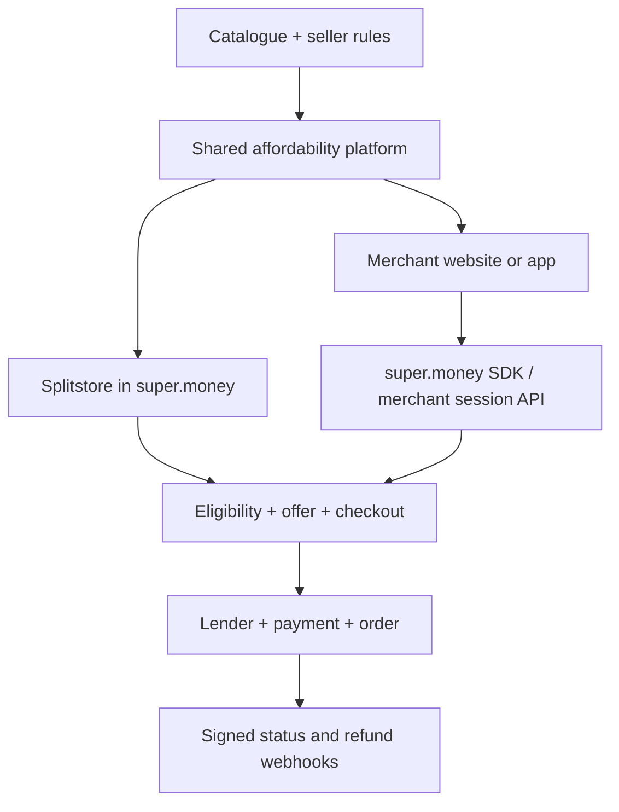
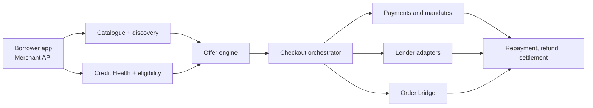

# super.money Affordable Commerce: Leadership Proposal

## Executive Summary

The supplied super.money app recording shows an existing journey from payments
into Credit Centre, credit score, score-building products, and credit access.
Splitstore already appears as a shopping surface inside the UPI home.

That changes the starting question. The opportunity is:

> How can super.money use an existing payments and credit relationship to build
> an affordability-first commerce business with repeat usage and positive
> contribution?

The proposal has three product bets:

1. Affordability-first discovery for a narrow user and category wedge.
2. A bag and checkout flow that improves conversion and AOV while preserving
   transparent terms and responsible limits.
3. A Merchant Affordability OS that powers Splitstore and external merchant
   checkouts from the same catalogue, eligibility, offer, and orchestration layer.

Credit Health remains a full borrower capability. It is the trust and readiness
layer that helps users understand bureau information; it does not act as a promise
of approval.

## 1. Current State And Strategic Adjacency

Observed product direction:



super.money has three useful assets for this adjacency:

| Asset | Product value | Commerce implication |
|---|---|---|
| Transaction relationship | Frequent payment engagement | Low-cost distribution and repeated entry points |
| Credit relationship | Score, credit building, and partner lending surfaces | Ability to explain readiness and present eligible plans |
| Commerce and merchant proximity | Splitstore, merchant checkout capability, and ecosystem access | Faster supply and distribution validation |

The project therefore focuses on owning the **affordability layer**:

- What can this user responsibly buy?
- Which product and seller can support financing?
- Which approved plan is transparent and commercially viable?
- Can the resulting order repay, settle, refund, and repeat correctly?

## 2. Launch Objective

**Six-month objective**

Launch a controlled Affordable Commerce beta that proves:

1. Affordability-led discovery improves relevant product engagement.
2. Earlier plan visibility improves bag-to-order completion.
3. Financing raises AOV without unacceptable delinquency, fraud, or returns.
4. Sellers will fund offers when incrementality and settlement are measurable.
5. Repeat buyers generate positive cohort contribution.

**Twelve-month direction**

Build toward Rs. 100 Cr annualised GMV without owning inventory or logistics.
The target is a planning scenario, not a forecast.

## 3. Who We Launch For

### Primary Buyer Cohort

Existing high-frequency UPI users, primarily 21-35, who:

- Are considering a practical Rs. 5,000-Rs. 30,000 purchase
- Have predictable enough cash flow for a short repayment plan
- Have limited access to attractive traditional EMI or prefer a smaller upfront
  payment
- Need transparent total repayment and due dates
- Meet lender and product eligibility requirements

Payment activity must never become an underwriting input by assumption. Any use
of financial data requires a permitted purpose, explicit consent where required,
and the regulated lender's governed policy.

### Buyer Segments

| Segment | Primary need | Product proposition |
|---|---|---|
| Credit underserved | Traditional EMI access is limited | Eligible short-tenor Pay-in-3 or secured credit path |
| Cash-flow constrained | Can afford the purchase over time | Smaller amount today with a fixed schedule |
| Deal seeker | Can pay in full | Full UPI with a seller-funded offer |

Affordable Commerce serves all three. Credit is one affordability instrument.

### Initial Merchant

A digitally capable electronics or home-goods seller with:

- Valid KYB and settlement account
- Reliable inventory and price feed
- Low cancellation and return rates
- Clear warranty and fulfilment SLAs
- Enough margin to test targeted subvention
- Webhook or order-management integration capability

## 4. What We Sell First

Category selection uses:

```text
Category attractiveness =
purchase intent
x affordability need
x AOV
x supply readiness
x merchant funding capacity
- return complexity
- fraud risk
- operational cost
```

| Category | Affordability need | Return/fraud complexity | Supply readiness | MVP decision |
|---|---:|---:|---:|---|
| Budget/refurbished phones | High | Medium | High | Launch |
| Small home appliances | High | Low | High | Launch |
| Work/study devices | Medium-high | Low | Medium | Launch |
| Mobile/audio accessories | Medium | Low | High | Bundle and repeat |
| Fashion | Low-medium | High | High | Later |
| Furniture | High | Medium-high | Medium | Later |
| Travel | High | High operational complexity | Medium | Later |
| Luxury | High ticket, weak responsibility fit | High | Medium | Exclude |

The controlled catalogue begins with 100-300 eligible SKUs across three category
groups. Product breadth expands only after repeat contribution and operational
quality are proven.

## 5. Product Bet One: Affordability-First Discovery

### Placement

- Splitstore remains a full-screen commerce destination entered from UPI home.
- Credit Health remains in `Profile -> Credit centre -> My credit score`.
- The Credit tab can provide a secondary Credit Health entry.
- Credit Health can explain that a commerce limit uses more than the score and
  offer a contextual path to eligible products.

### Discovery Architecture

The store leads with:

- Under Rs. 1,000 due today
- Rs. 1,000-Rs. 2,500 due today
- Rs. 2,500+ due today
- Best Pay-in-3 plans
- Full-UPI offers

Each product card shows:

- Total product price
- Amount due today
- Number and size of future payments
- Fee or APR summary
- Seller-funded cashback
- Delivery and return promise

The ranking service joins user eligibility, product rules, seller quality,
inventory, returns, offer funding, and expected contribution.

### Credit Health Management

The borrower can:

1. Give purpose-specific bureau consent.
2. Retrieve the latest available score and see source and freshness.
3. Understand positive, negative, and developing factors.
4. Start three prioritised actions.
5. View no-file guidance.
6. Retain a dated score during a bureau delay.
7. Report inaccurate data and track the case.

The product states explicitly that a score is educational and that lender
approval uses additional policies and data.

## 6. Product Bet Two: Bag, Financing, And Checkout

### Bag

The bag is the primary AOV and responsibility surface. It shows:

- Items and sellers
- Total price
- Amount due today
- Future payments
- Available limit remaining after purchase
- One relevant add-on that still fits the current limit
- How adding the item changes every repayment

Example:

```text
Nova X1 5G                  Rs. 2,999 today
Pulse Buds 2 add-on           Rs. 833 today
------------------------------------------------
Two-item bag                Rs. 3,832 today
Future payments             Rs. 3,832 x 2
Total payable               Rs. 11,496
Remaining limit             Rs. 504
```

### Checkout



Before confirmation the user sees lender attribution, APR, fees, total payable,
repayment dates, AutoPay account, KFS, return treatment, and a full-UPI fallback.

### Post-Purchase

One timeline links:

- Order ID
- Loan or payment ID
- Shipment
- Repayment dates
- Return/refund adjustment
- Seller and lender status

A financed refund first adjusts the outstanding obligation. Any remaining
customer refund is calculated only after that reconciliation.

## 7. Product Bet Three: Merchant Affordability OS

### Seller Jobs

1. Complete KYB, payout, catalogue, and webhook setup.
2. Submit products and understand financeability.
3. Fund an offer and forecast conversion, cost, and contribution.
4. Fulfil an order without managing lender states.
5. Reconcile fees, offer funding, refunds, and payout.
6. Compare conversion, AOV, repeat, returns, DPD, and contribution.

### Two Distribution Channels



**Channel 1: Splitstore**

super.money owns discovery, PDP, bag, checkout, and post-purchase.

**Channel 2: Merchant checkout**

The merchant shows an affordability option on its own PDP. Its server creates a
signed session, the customer authenticates with super.money, and the same
eligibility, offer, disclosure, and orchestration services complete the purchase.

### Merchant API Surface

| Method | Endpoint | Purpose |
|---|---|---|
| `POST` | `/v1/merchant-sessions` | Create signed external checkout session |
| `GET` | `/v1/merchant-sessions/{id}/offers` | Return approved customer plans |
| `POST` | `/v1/merchant-sessions/{id}/confirm` | Confirm consent, payment, and order |
| `POST` | `/v1/refunds` | Start full or partial refund reconciliation |
| Webhook | `checkout.completed` | Final checkout state |
| Webhook | `order.updated` | Fulfilment change |
| Webhook | `refund.adjusted` | Credit and order refund outcome |
| Webhook | `settlement.completed` | Seller payout outcome |

## 8. Scope-To-Prototype Traceability

| Problem | Prototype component | Metric | Business effect |
|---|---|---|---|
| Score is hard to act on | Credit Health factors and three-action plan | Action-start rate | Better trust and future readiness |
| Bureau partner is delayed | Saved score and retry/notification state | Successful refresh, stale-data age | Avoids fabricated or missing data |
| Generic categories ignore cash flow | Due-today budget controls | Store-to-PDP | More relevant discovery |
| Eligibility appears too late | Limit and repayment on cards/PDP | PDP-to-bag | Less surprise abandonment |
| Generic cross-sell can overextend users | Financeable bag add-on with remaining limit | Attach rate, AOV | Responsible basket growth |
| Credit checkout has multiple failure points | One orchestrated confirmation | Checkout-to-order | Fewer partial failures |
| Seller funding may subsidise natural demand | Offer simulator and holdout | Incremental orders | Efficient merchant spend |
| Merchant adoption requires integration | Setup checks and merchant API | Time-to-live | More supply and external distribution |
| GMV can hide losses | Repeat, risk, and contribution dashboard | Repeat buyers, contribution/order | Durable P&L |

## 9. Funnel And Experiments

### Canonical Funnel

| Stage | Illustrative monthly count | Step conversion |
|---|---:|---:|
| Targeted eligible exposure | 1,500,000 | 100% |
| Splitstore visit | 180,000 | 12.0% |
| Product detail | 54,000 | 30.0% |
| Add to bag | 18,900 | 35.0% |
| Checkout start | 14,553 | 77.0% |
| Offer selected | 12,141 | 83.4% |
| Completed order | 10,800 | 89.0% |

At Rs. 7,700 AOV this produces approximately Rs. 8.3 Cr monthly GMV, or
approximately Rs. 100 Cr annualised GMV.

### Experiment One: Affordability Before Cart

- Control: price-first product card
- Variant: amount-due-today and repayment-first card
- Primary metric: PDP-to-bag
- Secondary metrics: checkout start and AOV
- Guardrails: ineligible impressions, return rate, 30+ DPD, contribution/order

### Experiment Two: Responsible Bundle

- Control: bag without add-on
- Variant: one add-on inside available limit with repayment delta
- Primary metric: contribution-positive AOV
- Secondary metric: attach rate
- Guardrails: checkout completion, cancellation, return, DPD

### Experiment Three: Down Payment

- Variants: 20%, 33%, and 50% for policy-approved cohorts and SKUs
- Primary metric: contribution-positive completed-order rate
- Guardrails: approval, 30+ DPD, fraud, cancellation, and support contacts

### Experiment Four: Seller Funding

- Treatment: seller-funded lower upfront amount
- Holdout: same eligible cohort without funding
- Primary metric: incremental completed orders
- Guardrails: seller contribution, platform contribution, and refund-adjusted GMV

## 10. P&L

Illustrative completed order:

| Line | Rs./order | % of Rs. 7,700 AOV |
|---|---:|---:|
| Merchant/take revenue | 139 | 1.80% |
| Lender/affordability service revenue | 92 | 1.20% |
| Payment/affiliate revenue | 15 | 0.20% |
| **Gross variable revenue** | **246** | **3.20%** |
| Rewards and funded offer share | -55 | -0.71% |
| Payment and mandate cost | -10 | -0.13% |
| Servicing and support | -18 | -0.23% |
| Fraud and refund operations | -20 | -0.26% |
| Platform risk/expected-loss exposure | -65 | -0.84% |
| Infrastructure and communications | -8 | -0.10% |
| **Contribution before fixed cost** | **70** | **0.91%** |

At 10,800 orders per month:

- Monthly GMV: approximately Rs. 8.3 Cr
- Monthly contribution before fixed cost: approximately Rs. 7.6 L
- Annualised contribution before fixed cost: approximately Rs. 91 L

Actual economics depend on merchant contracts, lender structure, risk-sharing
boundaries, category mix, tax, and incentive strategy.

## 11. Metrics

**North Star**

Monthly repeat Affordable Commerce buyers.

**Scale gate**

Cohort contribution remains positive after the full variable-cost stack.

| Metric family | Metrics |
|---|---|
| Discovery | Store CTR, PDP rate, eligible impression rate |
| Conversion | PDP-to-bag, bag-to-checkout, offer selection, order completion |
| Monetisation | AOV, GMV/buyer, take rate, contribution/order |
| Retention | 30/60/90-day repeat, purchase frequency |
| Credit | Approval, mandate success, 7+ DPD, 30+ DPD, expected loss |
| Commerce quality | Cancellation, return, refund TAT, seller SLA |
| Merchant | Time-to-live, financeable SKU rate, funded-offer incrementality |
| Trust | KFS views, consent completion, support contacts, disputes |

## 12. Six-Month GTM

| Month | Product and operating objective | Exit evidence |
|---|---|---|
| 1 | Interview 30 buyers and 15 merchants; analyse existing funnels; lock categories and economics | Validated jobs, baseline funnel, risk boundaries |
| 2 | Finalise prototypes, seller onboarding, API contracts, data model, lender and compliance reviews | Signed MVP contract |
| 3 | Build catalogue, discovery, bag, quote, consent, and one lender adapter | Internal end-to-end transaction |
| 4 | Add order bridge, repayments, refunds, seller settlements, support timeline, and analytics | Reconciled alpha orders and refunds |
| 5 | Launch 1,000-user alpha with 3 anchor sellers and 100-300 SKUs | Funnel, risk, and operations within thresholds |
| 6 | Controlled 50,000-user beta with holdouts and daily monitoring | Go/no-go decision for broader distribution |

Expansion follows:

1. More eligible users and anchor sellers
2. More low-complexity categories
3. Personalised offer ranking
4. External merchant checkout
5. Repayment-led offer improvement

## 13. Simplified System



The leadership presentation explains one failure:

```text
Loan booked
  -> order creation fails
  -> checkout remains non-final
  -> orchestrator requests loan cancellation/reversal
  -> reconciliation verifies both external systems
  -> customer sees success only after a valid terminal state
```

Idempotency, explicit state transitions, compensating actions, and reconciliation
are product requirements because the checkout spans independently failing systems.

## 14. Compliance And Trust

The product requires:

- Purpose-specific, revocable data consent
- Latest-available language for bureau data
- Lender attribution
- APR, fees, total repayment, and due dates
- Versioned KFS before execution
- Stored consent and document hashes
- Clear order-versus-credit contract boundaries
- Full-UPI fallback
- Grievance and dispute tracking
- Refund-to-outstanding-loan reconciliation
- Data minimisation, retention, access, and audit controls

Credit Health and commerce consent are separate. Checking a score does not create
a credit application, and a score does not guarantee an offer.

## 15. Three-Minute Video

| Time | Frame | Message |
|---|---|---|
| 0:00-0:20 | Existing app journey | super.money already connects payments and credit; commerce is the next affordability use case |
| 0:20-0:45 | Customer and category wedge | Start with one cohort and three practical category groups |
| 0:45-1:15 | Borrower prototype | Due-today discovery, bag, transparent plan, and Credit Health |
| 1:15-1:40 | Seller and white-label | One seller OS powers Splitstore and merchant checkout |
| 1:40-2:10 | Funnel, experiment, and P&L | Repeat buyers are the North Star; contribution is the scale gate |
| 2:10-2:35 | System and edge case | One orchestrator coordinates lender, payment, and order failures |
| 2:35-3:00 | GTM, compliance, close | Controlled six-month launch and an affordability infrastructure vision |

## 16. Leadership Email

**Subject:** Product proposal for super.money Affordable Commerce

Hi [Name],

I came across the Product Manager - Commerce role and used it as a prompt to study
how super.money could extend its existing payments and credit relationship into
commerce.

My proposal starts from the current product: users can already engage with credit
health, credit building, and credit access, while Splitstore provides a commerce
entry point. I explored how that could become a focused affordability business
instead of a broad marketplace.

I designed three connected bets:

1. Affordability-first discovery for a narrow user and category cohort.
2. A bag and checkout that connects AOV growth with clear repayment and risk
   controls.
3. A merchant operating system that powers both Splitstore and white-label
   merchant checkout.

I also built the supporting Credit Health management journey, seller portal,
unit economics, experiments, six-month GTM, and service/API architecture.

Borrower prototype:
https://super-money-affordable-commerce.naman884186.chatgpt.site/buyer

Seller prototype:
https://super-money-affordable-commerce.naman884186.chatgpt.site/seller

The project is intentionally explicit about decisions, assumptions, and failure
states. I would value the opportunity to compare this proposal with what your
team is learning from real users, merchants, lenders, and portfolio performance.

Best,

Naman Jain

## 17. Decisions To Defend In Discussion

1. I chose an affordability layer because super.money already has payments and
   credit primitives.
2. I chose one buyer cohort and three category groups because category breadth
   would hide product-market-fit evidence.
3. I introduced a bag because the role owns cart-to-checkout and AOV, and because
   repayment-aware bundles are a differentiated commerce mechanic.
4. I use repeat buyers as the North Star because one subsidised purchase does not
   prove commerce habit.
5. I use contribution as a scale gate because GMV can grow while incentives,
   returns, fraud, servicing, or credit losses destroy value.
6. I separated Credit Health from offer eligibility because bureau education and
   regulated credit decisioning have different purposes and consent.
7. I support two merchant channels because white-label affordability can extend
   the platform beyond in-app marketplace demand.
8. I keep the 25-service architecture in the technical appendix because leadership
   needs the system decision before the complete service inventory.

## Sources

- Product behavior observed in the supplied super.money app recording, 26 Jul 2026
- super.money product overview: https://super.money/product
- super.money homepage: https://www.super.money/
- super.money Splitstore page: https://super.money/splitstore
- super.money superPayLater page: https://www.super.money/superPayLater
- super.money Breeze merchant checkout: https://super.money/breeze
- super.money merchant terms: https://super.money/merchant-terms
- Reserve Bank of India Digital Lending Directions, 2025:
  https://rbi.org.in/Scripts/NotificationUser.aspx?Id=12848&Mode=0
- RBI pre-sanctioned credit lines through UPI:
  https://www.rbi.org.in/scripts/RTGS_Notification.aspx?Id=12532
- NPCI UPI product overview: https://www.npci.org.in/product/upi/about-upi
- TransUnion CIBIL consumer dispute process:
  https://www.transunioncibil.com/content/dam/transunion-cibil/corporate/documents/disputes.pdf
