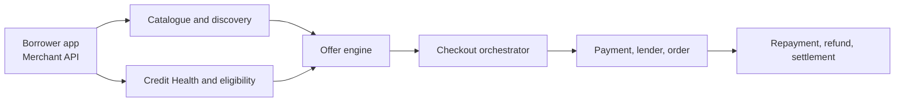
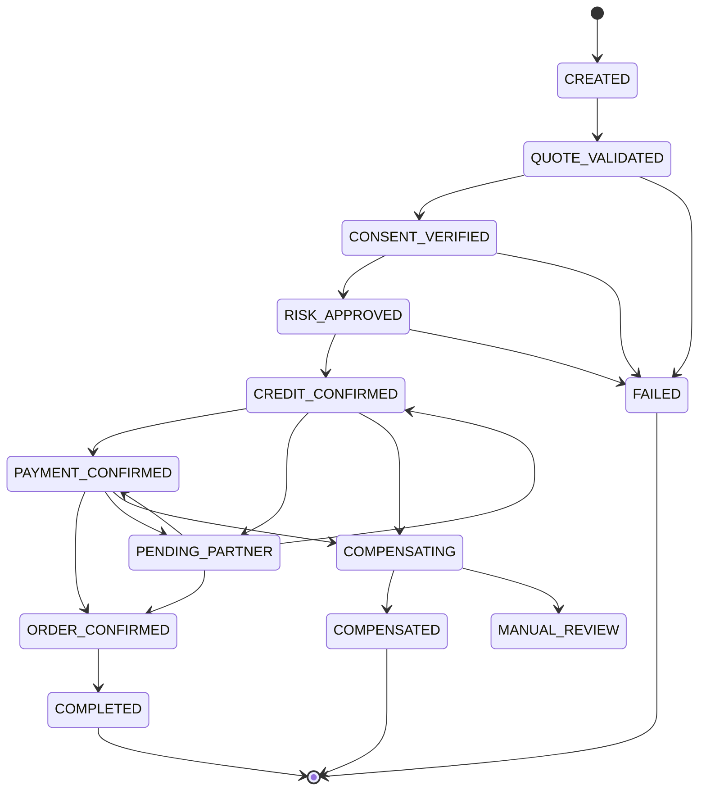
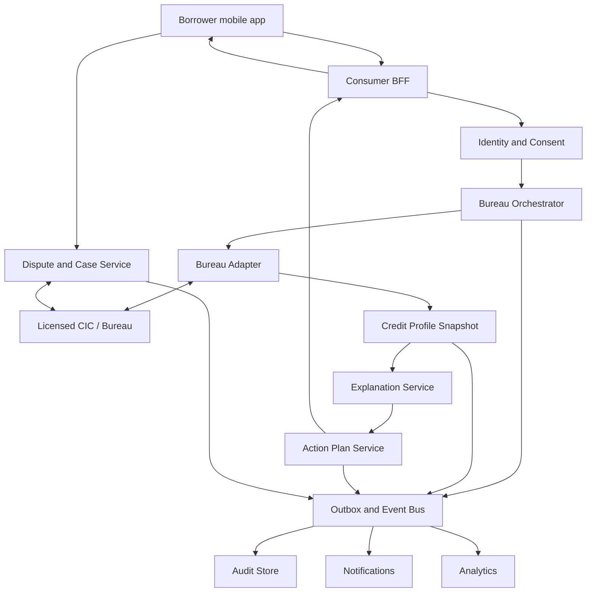
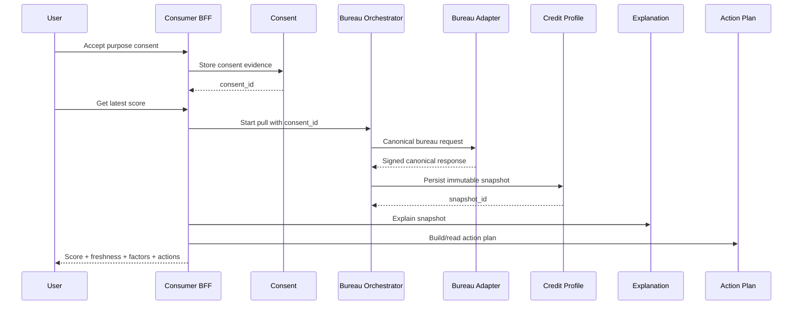

# Affordable Commerce System Design: Beginner-to-Production Deep Dive

- **Document type:** Technical architecture and API design
- **Audience:** Product managers, beginner programmers, engineers, architects,
  risk, compliance, operations, and seller-platform teams
- **Architecture status:** Conceptual production design for the
  affordable-commerce proposal
- **Last reviewed:** 26 July 2026

> This document teaches the system from first principles. It starts with a simple
> mental model, follows one purchase from beginning to end, and then goes into
> service internals, APIs, databases, events, failure handling, security,
> deployment, and operations.

> This is an independent product and engineering concept. It is not a statement of
> super.money's current internal architecture. Lending, payments, KYC, data use,
> accounting, and regulatory responsibilities must be validated with the relevant
> regulated entities, partner banks, NPCI participants, legal counsel, and
> compliance teams before implementation.

---

## Table of Contents

1. [The System in One Sentence](#1-the-system-in-one-sentence)
2. [How to Read This Document](#2-how-to-read-this-document)
3. [Prototype Versus Production](#3-prototype-versus-production)
4. [Beginner Concepts and Vocabulary](#4-beginner-concepts-and-vocabulary)
5. [A Single Running Example](#5-a-single-running-example)
6. [System Context and Responsibility Boundaries](#6-system-context-and-responsibility-boundaries)
7. [Architecture Goals, Non-Goals, and Scale](#7-architecture-goals-non-goals-and-scale)
8. [The Complete Service Map](#8-the-complete-service-map)
9. [Every Service in Depth](#9-every-service-in-depth)
10. [End-to-End Workflows](#10-end-to-end-workflows)
11. [API Architecture](#11-api-architecture)
12. [Detailed API Contracts](#12-detailed-api-contracts)
13. [Events and Webhooks](#13-events-and-webhooks)
14. [Data and Schema Design](#14-data-and-schema-design)
15. [Consistency, Idempotency, and the Checkout Saga](#15-consistency-idempotency-and-the-checkout-saga)
16. [Security, Privacy, and Regulatory Controls](#16-security-privacy-and-regulatory-controls)
17. [Deployment and Infrastructure](#17-deployment-and-infrastructure)
18. [Reliability, Observability, and Operations](#18-reliability-observability-and-operations)
19. [Testing Strategy](#19-testing-strategy)
20. [How the Current Prototype Maps to the Design](#20-how-the-current-prototype-maps-to-the-design)
21. [Suggested Codebase Structure](#21-suggested-codebase-structure)
22. [Implementation Sequence](#22-implementation-sequence)
23. [Architecture Decisions and Open Questions](#23-architecture-decisions-and-open-questions)
24. [Glossary](#24-glossary)
25. [Primary References](#25-primary-references)
26. [Credit Health Management System](#part-ii-credit-health-management-system)

---

## 1. The System in One Sentence

The system lets an eligible buyer discover a seller's product by what the buyer
can responsibly pay, choose a transparent payment or credit plan, complete one
coordinated checkout, receive the product, repay any credit obligation, and get a
correct refund if the order changes.

That sentence contains three systems that must behave as one:

1. **Commerce:** products, inventory, orders, delivery, returns, and sellers.
2. **Credit:** eligibility, lender offers, KFS, loan or credit-line usage,
   repayments, delinquency, and closure.
3. **Payments:** UPI authorization, down payment, mandates, repayment payments,
   refunds, and settlement evidence.

The buyer should experience one purchase. Internally, the platform must preserve
the separate legal and operational records of all three systems.

### 1.1 Six-capability leadership map

The complete architecture contains many responsibilities. Start with these six
capabilities:



Read it in plain English:

1. A borrower or merchant channel starts a request.
2. Catalogue decides what supply is valid and discoverable.
3. Credit Health explains bureau data; eligibility separately decides whether a
   user and transaction can proceed.
4. Offer Engine constructs transparent plans.
5. Checkout Orchestrator runs the multi-system transaction.
6. Downstream ledgers preserve repayment, refund, and seller money.

The detailed 25-service map later in the document decomposes these capabilities
for ownership, security, scaling, and failure isolation. It is an implementation
map rather than the opening product story.

---

## 2. How to Read This Document

The document uses progressive depth.

| Layer | What it teaches | Best for |
|---|---|---|
| Mental model | What the system is and why services exist | First-time reader |
| Pictures | Which components communicate | Product and engineering discussion |
| Service cards | Inputs, outputs, storage, algorithms, and dependencies | Understanding each backend |
| Workflows | The exact order of calls and events | Understanding runtime behavior |
| APIs and schemas | Concrete request, response, event, and table shapes | Beginning implementation |
| Reliability and security | What happens when systems fail or are attacked | Production readiness |
| Code map | How the current React prototype relates to the future system | Reading this repository |

You do not need to memorize the diagrams. Start with the running example in
Section 5. Return to the diagrams after reading the service cards.

### 2.1 A convention used throughout

Each service description answers the same questions:

- **What does it do?**
- **What does it not do?**
- **What comes in?**
- **What goes out?**
- **What data does it own?**
- **Which services does it call?**
- **Which events does it publish or consume?**
- **What happens when it fails?**

### 2.2 Commands, queries, and events

These three words appear often:

| Type | Plain-English meaning | Example |
|---|---|---|
| Query | "Tell me something, but do not change it." | Get eligible plans |
| Command | "Try to change something." | Confirm checkout |
| Event | "Something already happened." | `OrderPlaced` |

A command can fail. An event describes a fact that has already been committed.

### 2.3 Visual learning path

Use the pictures in this order. This moves from the simplest business boundary
to the most detailed engineering view.

| Order | Picture | Question it answers | What to follow |
|---:|---|---|---|
| 1 | [System context](diagrams/system-context.svg) | Who participates, and who is legally or operationally responsible? | Start with the buyer and seller, then follow arrows into lenders, UPI, logistics, and the platform. |
| 2 | [Complete service map](diagrams/service-architecture.svg) | Which capabilities exist inside the platform? | Read one horizontal layer at a time; do not try to follow every arrow initially. |
| 3 | [API architecture](diagrams/api-architecture.svg) | How does a mobile, seller, or merchant request reach a service? | Read left to right from client, edge security, BFF/API, domain service, outbox, event, and webhook. |
| 4 | [Checkout sequence](diagrams/checkout-saga.svg) | In what order do quote, consent, risk, lender, payment, and order actions happen? | Read the numbered arrows from top to bottom; dotted arrows are responses. |
| 5 | [Refund and settlement sequence](diagrams/refund-settlement.svg) | How does a return change credit, buyer money, and seller payout? | Follow lender adjustment first, buyer excess second, and seller reversal third. |
| 6 | [Core data model](diagrams/core-data-model.svg) | Which records connect a user and seller to a quote, checkout, loan, payment, order, refund, and settlement? | Begin at `CHECKOUT_SESSION` in the middle and move outward. `PK` is a primary key; `FK` is a foreign key. |
| 7 | [Deployment topology](diagrams/deployment-topology.svg) | Where does the software run, and how does it survive failures? | Start at the public edge, enter the India primary region, compare both availability zones, then inspect disaster recovery. |
| 8 | [Credit Health architecture](diagrams/credit-health-architecture.svg) | How do bureau retrieval, score snapshots, factors, actions, and corrections connect? | Follow consent into the bureau adapter, then the snapshot, explanation, action, event, and correction paths. |

Every diagram also has an adjacent `.mmd` Mermaid source file. A reader can
inspect or edit that text without using a drawing application.

---

## 3. Prototype Versus Production

The repository contains a working **experience prototype**, not the production
backend described in this document.

| Area | Current repository | Production system described here |
|---|---|---|
| Buyer screens | React components with in-memory state | Mobile client calling authenticated APIs |
| Seller portal | React components with fictional data | Web client calling seller and partner APIs |
| Products | Static objects in `prototype/src/data.js` | Catalogue database, search index, seller feeds |
| Eligibility | Fixed labels and plans | Lender rules, user profile, risk, and SKU policy |
| Checkout | Local screen transition | Durable saga across lender, payment, and order systems |
| Payment | Simulated success | UPI/PSP partner integration and verified callbacks |
| Loan | Fictional lender label | Regulated lender API and lender legal ledger |
| Repayment | Static schedule | Lender status sync and local operational projection |
| Refund | Demonstrated conceptually | Idempotent lender, buyer, order, and seller reconciliation |
| Data | Browser memory | Encrypted, India-resident domain data stores |

### 3.1 Why keep the prototype simple?

The prototype answers product questions:

- Can buyers understand affordability before checkout?
- Can a seller manage financeability without operating a lender workflow?
- Does one unified timeline make a financed order understandable?

Production services answer a different question:

> Can the product maintain correct money, credit, order, consent, and audit state
> when independent partner systems are slow, unavailable, or contradictory?

---

## 4. Beginner Concepts and Vocabulary

### 4.1 What is a service?

A service is a backend program with one clear area of responsibility.

Think of a restaurant:

- The catalogue service is the menu manager.
- The eligibility service is the person checking which offers a customer can use.
- The checkout orchestrator is the floor manager coordinating all teams.
- The payment service is the cashier.
- The order bridge is the kitchen ticket system.
- The event bus is the announcement system.

Each team has its own records and rules. They communicate through defined
messages instead of reading and changing each other's private databases.

### 4.2 What is an API?

An API is a contract that lets one program ask another program to do something.

Example:

```http
POST /v1/affordability/quotes
```

The caller sends a user, product, and quantity. The API returns available plans.
The contract defines required fields, response fields, errors, authorization, and
whether the operation is safe to retry.

### 4.3 What is a database?

A database stores durable facts owned by one service. "Durable" means the facts
remain after a server restarts.

One service should not directly update another service's tables. It should use the
owner's API or consume the owner's events. This rule prevents hidden coupling.

### 4.4 What is an event?

An event is a durable message saying that a state change has happened:

```json
{
  "type": "commerce.order.placed.v1",
  "order_id": "ord_01J...",
  "occurred_at": "2026-07-25T14:30:00Z"
}
```

Services can react independently. Notifications can send a message, analytics can
record conversion, and settlement can prepare a future payout without making the
checkout API wait for all three.

### 4.5 What is a BFF?

**BFF** means Backend for Frontend. It is an API layer shaped for one client.

- The Consumer BFF returns compact mobile screens.
- The Seller BFF returns tables, filters, and operational summaries.

A BFF combines data. It should not become the legal source of loan, payment, or
order truth.

### 4.6 What is orchestration?

Orchestration means one component controls the order of a multi-step workflow.
The Checkout Orchestrator knows that quote validation, consent, credit,
payment, and order placement must be coordinated.

### 4.7 What is idempotency?

An operation is idempotent when repeating the same request does not repeat the
business effect.

If a buyer taps "Confirm" twice, the system must return the same checkout result.
It must not create two orders or collect two payments.

### 4.8 What is a saga?

A saga is a long transaction split across independent systems.

A normal database transaction can roll back changes inside one database. It
cannot roll back a lender, a bank, and a seller OMS together. A saga records each
step and runs a compensating action when a later step fails.

Example:

- Down payment succeeds.
- Order placement fails permanently.
- Compensation requests a payment reversal and releases the lender reservation.

### 4.9 What is a ledger?

A ledger is an append-only record of money or obligation changes. Instead of
editing the past, the system adds a reversing entry.

This creates an audit trail:

```text
+899700 paise  order gross value
-13500 paise   merchant fee
-9000 paise    seller-funded offer
-899700 paise  full refund reversal
```

### 4.10 What is a system of record?

A **system of record** is the authoritative owner of a fact.

- The lender's loan-management system is authoritative for the legal loan.
- The PSP or bank is authoritative for the payment transaction.
- The seller OMS is authoritative for fulfilment if the seller owns the order.
- super.money is authoritative for the checkout session and cross-system links.

Copies are allowed for speed and user experience, but they must identify their
source and last synchronization time.

---

## 5. A Single Running Example

This document follows one fictional purchase:

| Field | Example |
|---|---|
| Buyer | Asha Mehta |
| Product | Nova X1 5G |
| Seller | ValueKart Electronics |
| Price | Rs. 8,997 |
| Selected plan | Pay in 3 |
| Amount due now | Rs. 2,999 |
| Later instalments | Rs. 2,999 and Rs. 2,999 |
| Regulated lender | Example lender adapter target |
| Commerce order | `ord_01J...` |
| Lender reference | `lnd_82...` |

### 5.1 What Asha sees

1. The home screen says she has up to Rs. 12,000 available for eligible
   purchases.
2. The product card says "Rs. 2,999 today".
3. The product page shows all dates, total payable, lender, fees, and KFS.
4. Asha accepts the exact plan and confirms.
5. She sees one success screen with order and repayment information.

### 5.2 What the system does

1. Catalogue confirms the SKU is active and in stock.
2. Eligibility confirms Asha can use a supported lender or credit rail.
3. Risk checks the buyer, device, seller, SKU, and velocity.
4. The Affordability Engine creates a versioned quote.
5. Consent Service stores the exact document and acceptance proof.
6. Checkout coordinates lender, payment, and order systems.
7. Events update the repayment view, seller portal, analytics, and support.
8. Reconciliation jobs compare local state with partner records.

The most important design principle is this:

> The system never treats a screen transition as proof that money, a loan, or an
> order exists. It waits for authoritative partner evidence and records the link.

---

## 6. System Context and Responsibility Boundaries


[Open the editable Mermaid source](diagrams/system-context.mmd).

### 6.1 Reading the picture

- People and partner systems are outside the main platform box.
- Arrows show information or commands crossing a trust boundary.
- The platform coordinates the experience.
- The regulated lender remains responsible for the legal credit product.
- The UPI/PSP/bank side authorizes and records the actual payment rail.
- The seller or marketplace side fulfils the product.

### 6.2 Responsibility table

| Responsibility | Primary owner | super.money responsibility |
|---|---|---|
| Buyer app experience | super.money | Full ownership |
| Seller portal and partner APIs | super.money | Full ownership |
| Product catalogue normalization | super.money | Full ownership |
| Buyer and SKU matching | Shared policy | Apply documented policy consistently |
| Final credit sanction | Regulated lender (RE) | Route request and display result |
| KFS and loan agreement | Regulated lender | Present, preserve version, capture proof |
| Legal loan balance | Regulated lender LMS | Show a synchronized projection |
| UPI authorization | PSP, issuer/remitter bank, NPCI rail | Initiate and reconcile |
| UPI PIN | Bank/NPCI-approved UPI common flow | Never receive, store, or log |
| Product fulfilment | Seller, marketplace, logistics | Map and display status |
| Seller payout calculation | super.money commercial ledger | Calculate, explain, and reconcile |
| Customer grievance ownership | Regulated entity remains responsible for lending complaints | Provide an accessible interface and linked case |

### 6.3 Credit and payment rails are not the same flow

The UI may call all of these "ways to pay", but the backend must branch correctly.

| Rail | What it really is | Per-purchase loan booking? | Main external owner |
|---|---|---:|---|
| Full UPI | Immediate account-to-merchant payment | No | PSP and banks |
| Purchase-specific BNPL / Pay in 3 | A digital loan for a specified purchase | Usually yes | Regulated lender |
| Credit Line on UPI | Draw against a pre-sanctioned bank credit line linked to UPI | Not necessarily; issuer records drawdown | Issuing scheduled commercial bank |
| RuPay credit card on UPI | Merchant payment from a linked RuPay credit card | No new loan; EMI conversion is issuer-side credit behavior | Card issuer |
| Card/credit EMI conversion | Conversion of an eligible purchase into instalments | Issuer-specific | Issuer bank |

The Payment Orchestrator selects a rail adapter. The Lender Adapter is used only
when the selected construct requires lender eligibility, documents, booking, or
loan servicing.

The RBI allows payments through pre-sanctioned credit lines issued by scheduled
commercial banks to individuals on UPI with prior customer consent. The bank sets
the credit-line terms. See the
[RBI Credit Line on UPI circular](https://www.rbi.org.in/scripts/RTGS_Notification.aspx?Id=12532).

### 6.4 Systems of record

| Fact | Authoritative system | Local copy |
|---|---|---|
| User app profile | Identity and User Profile Service | Consumer BFF cache |
| Consent evidence | Consent and Document Service | Immutable audit index |
| Product master | Catalogue Service | Search index |
| Affordability quote | Offer and Affordability Engine | Checkout snapshot |
| Checkout progression | Checkout Orchestrator | Support timeline read model |
| Loan contract and balance | Lender LMS | Loan mirror and Repayment Ledger |
| Payment result | PSP/issuer bank | Payment attempt and reconciliation record |
| Order fulfilment | Seller/marketplace OMS | Order Bridge mirror |
| Seller settlement | Settlement Service ledger | Seller portal read model |

If two systems disagree, reconciliation uses this table to decide which system is
authoritative and whether an automatic repair is allowed.

---

## 7. Architecture Goals, Non-Goals, and Scale

### 7.1 Functional goals

The platform must:

1. Ingest and normalize seller products.
2. decide whether a user and SKU combination may see each payment plan.
3. Show transparent, versioned plans before confirmation.
4. Coordinate payment, credit, consent, and order placement without duplicates.
5. Maintain a unified post-purchase timeline.
6. Reconcile full and partial refunds.
7. Explain seller fees, offer funding, reversals, and payout.
8. Produce risk-adjusted product and business analytics.

### 7.2 Non-functional goals

Non-functional requirements describe *how well* the system works.

| Requirement | Initial target | Why it matters |
|---|---:|---|
| Commerce home availability | 99.95% monthly | Discovery should degrade gracefully |
| Checkout command availability | 99.9% monthly | Partner dependency failures are expected |
| Quote API latency | p95 under 350 ms from platform, excluding cold partner calls | Slow plans reduce conversion |
| Checkout create latency | p95 under 500 ms | Session creation is local |
| Checkout completion | Asynchronous status allowed after 8-12 seconds | Banks and lenders may be slow |
| Duplicate financial effects | Zero tolerated | Money and credit correctness |
| Event delivery | At least once, normally under 5 seconds | Subscribers must deduplicate |
| Recovery point objective | 5 minutes for operational stores; lower for ledgers where supported | Limits data loss |
| Recovery time objective | 60 minutes for a regional disaster | Defines failover investment |
| Audit evidence | Immutable and queryable | Disputes and regulatory reviews |

`p95` means 95 out of 100 requests are faster than the stated duration.

### 7.3 Illustrative design envelope

These are planning assumptions, not forecasts:

| Dimension | MVP | Scale-ready design |
|---|---:|---:|
| Active commerce users | 100,000 | 20 million |
| Products | 100,000 | 10 million |
| Sellers | 50 | 100,000 |
| Peak browse requests | 300 requests/second | 20,000 requests/second |
| Peak quote requests | 100 requests/second | 5,000 requests/second |
| Peak checkout confirms | 20 requests/second | 1,000 requests/second |
| Events per completed order | 20-60 | 20-60 |

Browse traffic is much larger than checkout traffic. Catalogue, search, and
affordability reads need aggressive caching and horizontal scaling. Checkout
needs stronger consistency and idempotency rather than the highest throughput.

### 7.4 Explicit non-goals

The first version does not build:

- A new credit bureau.
- A lender's complete loan-management system.
- A proprietary UPI switch.
- A logistics network.
- An unrestricted marketplace across every category.
- A machine-learning underwriting model with no lender policy control.
- A shared database that all teams edit.

---

## 8. The Complete Service Map


[Open the editable Mermaid source](diagrams/service-architecture.mmd).

### 8.1 How to read this larger diagram

Read it from top to bottom:

1. **Experience layer:** screens used by buyers, sellers, merchants, and support.
2. **API edge:** authenticates and routes calls.
3. **Domain services:** own business rules and durable state.
4. **Shared platform:** distributes events, messages, audits, and analytics.
5. **External systems:** legal or operational partner systems.

The full picture is intentionally dense. The service cards below explain one box
at a time.

### 8.2 Why not start with 25 independently deployed microservices?

Logical service boundaries do not require 25 separate deployments on day one.

A pragmatic MVP can use a **modular monolith**:

```text
commerce-platform
  modules/
    identity/
    seller/
    catalogue/
    affordability/
    checkout/
    order/
    refund/
    settlement/
```

Each module has a private schema or clearly owned tables and communicates through
interfaces. High-risk integrations such as lender and payment adapters can run as
separate workers. Services can be extracted when team ownership, scaling, or
failure isolation justifies the operational cost.

This document calls them "services" because the responsibility boundary matters,
even if several initially run in one deployable application.

---

## 9. Every Service in Depth

## 9.1 API Gateway

> **Beginner mental model:** The API Gateway is the guarded front door. It checks
> who is calling, limits abuse, attaches a request ID, and sends the request to the
> correct internal API.

### What it does

- Terminates TLS connections.
- Validates access tokens or partner credentials.
- Applies IP, account, device, and merchant rate limits.
- Routes `/consumer/*`, `/seller/*`, `/partner/*`, and `/webhooks/*`.
- Adds correlation and trace identifiers.
- Rejects requests that are too large or malformed.
- Records security-safe access logs.

### What it does not do

- It does not decide credit eligibility.
- It does not calculate prices.
- It does not store business records.
- It does not retry non-idempotent business commands automatically.

### Inputs and outputs

| Direction | Message | From or to |
|---|---|---|
| Input | HTTPS REST request | Mobile app, seller portal, merchant |
| Input | OAuth/JWT, mTLS certificate, or webhook signature | Caller |
| Output | Authenticated internal request | Appropriate BFF or webhook ingress |
| Output | Standard HTTP error | Caller |
| Output | Access metric and trace | Observability platform |

### How it works

1. CDN and WAF reject obvious attacks.
2. Gateway validates TLS and authentication.
3. Gateway checks route-specific quota.
4. It creates or validates `X-Request-Id`.
5. It forwards identity claims, not raw credentials, to the BFF.
6. It returns the BFF response without changing business meaning.

### Data it owns

No domain data. It may store short-lived rate-limit counters and API-client
configuration.

### Failure behavior

- Invalid token: `401 Unauthorized`.
- Authenticated caller lacks permission: `403 Forbidden`.
- Quota exceeded: `429 Too Many Requests` with `Retry-After`.
- Route unavailable: `503 Service Unavailable`.

The gateway must fail closed for authentication and fail predictably for routing.

---

## 9.2 Consumer BFF

> **Beginner mental model:** The Consumer BFF is a screen assembler for the mobile
> app. It asks multiple services for small pieces and returns one mobile-friendly
> response.

### What it does

- Builds commerce home, listing, product, checkout, and timeline responses.
- Converts domain objects into display-ready but non-deceptive view models.
- Hides internal service topology from the app.
- Applies client-version compatibility rules.
- Uses short-lived caches for non-sensitive read data.

### What it does not do

- It does not own products, quotes, orders, loans, or payments.
- It does not silently recompute accepted financial terms.
- It does not call a lender directly.

### Inputs and outputs

| Direction | Message | From or to |
|---|---|---|
| Input | Authenticated home/listing/PDP request | Consumer app |
| Input | Checkout command | Consumer app |
| Input | Profile, product, quote, timeline responses | Domain services |
| Output | Consumer JSON view model | Consumer app |
| Output | Queries and commands | Profile, Search, Affordability, Checkout, Repayment |

### Example composition

For `GET /v1/commerce/home`, the BFF may call:

1. Profile Service for first name and account state.
2. Eligibility Service for a safe credit summary.
3. Search Service for candidate products.
4. Affordability Engine for cached labels.
5. Experimentation Service for assigned layout variants.

The BFF uses strict time budgets. If recommendations time out, it can return a
smaller home page with full-UPI products. It must not invent credit eligibility.

### Data it owns

- Client compatibility configuration.
- Read-cache entries with short TTLs.
- No authoritative commerce or lending data.

### Failure behavior

- Optional rail fails: return partial content with an explicit unavailable state.
- Eligibility fails: hide credit labels and preserve full-UPI fallback.
- Checkout dependency fails: return the real retryable error; do not fake success.

---

## 9.3 Seller and Partner BFF

> **Beginner mental model:** This BFF turns many seller-domain records into the
> tables, filters, exports, and actions required by a seller portal or merchant
> integration.

### What it does

- Serves seller overview, catalogue, offers, orders, settlements, and analytics.
- Enforces seller-tenant isolation.
- Translates bulk imports into asynchronous jobs.
- Exposes stable partner APIs independent of internal service refactoring.
- Produces exports through asynchronous jobs rather than long HTTP requests.

### Inputs and outputs

| Direction | Message | From or to |
|---|---|---|
| Input | Seller portal request | Authenticated seller user |
| Input | Server-to-server API call | Merchant backend |
| Input | Seller-scoped data | Seller, Catalogue, Order, Settlement, Analytics |
| Output | Seller JSON or downloadable export reference | Portal or merchant |
| Output | Commands with seller identity | Domain services |

### Authorization model

Each request carries:

- `seller_id`
- human user or API client identity
- role such as `catalogue_editor`, `finance_viewer`, or `admin`
- permitted actions and optional store scope

The BFF never trusts a `seller_id` supplied only in the request body. It derives
the seller tenancy from the authenticated principal and checks any requested
resource against it.

### Failure behavior

- Bulk work returns `202 Accepted` and a job ID.
- Stale update returns `409 Conflict`.
- Export failure creates a retryable job state without blocking normal portal use.

---

## 9.4 Identity and User Profile Service

> **Beginner mental model:** This service knows who the app user is and the basic
> state of the user's relationship with the platform. It is not the lender's loan
> database.

### What it does

- Maps authenticated account identity to internal `user_id`.
- Stores KYC status references, app tenure, language, and account state.
- Stores tokenized references to verified bank or UPI relationships.
- Provides coarse profile facts required by eligibility and experience.
- Processes profile correction and account restriction events.

### What it does not do

- It does not store a UPI PIN.
- It does not expose raw KYC documents to every service.
- It does not approve credit.
- It does not calculate UPI transaction features.

### Inputs and outputs

| Direction | Message | From or to |
|---|---|---|
| Input | Account-created or profile-updated command | Identity platform |
| Input | KYC status callback | Approved KYC provider or compliance workflow |
| Input | Account restriction event | Risk or support process |
| Output | Minimal profile query response | BFF, Eligibility, Risk |
| Output | `UserProfileUpdated` event | Event Bus |

### Owned data

- `users`
- `user_preferences`
- tokenized external identity references
- account restriction status

Sensitive documents belong in the Consent and Document Service, not in general
profile tables.

### How it links to other services

- Eligibility reads age band, KYC state, and account status.
- Risk reads account tenure and restriction flags.
- Transaction Intelligence uses only the stable `user_id`.
- Consumer BFF reads display-safe profile fields.

### Failure behavior

Credit actions fail closed if required identity or KYC state is unavailable.
Browse can continue in a guest or full-UPI-only mode where product policy allows.

---

## 9.5 Consent and Document Service

> **Beginner mental model:** This is the evidence locker. It proves which document
> Asha saw, what data purpose she accepted, and when she accepted it.

### What it does

- Stores versioned consent text and purpose.
- Records explicit acceptance or withdrawal.
- Stores immutable hashes of KFS, sanction letter, and agreement files.
- Stores encrypted documents or lender-hosted document references.
- Produces signed, time-stamped acceptance evidence.
- Enforces retention and deletion policy by data class.

### Inputs and outputs

| Direction | Message | From or to |
|---|---|---|
| Input | Create consent session | Checkout or onboarding |
| Input | Document bytes/reference and metadata | Lender Adapter |
| Input | Accept, deny, or withdraw action | Consumer BFF |
| Output | Consent proof | Checkout, audit, lender workflow |
| Output | Document download authorization | Consumer or support BFF |
| Output | `ConsentGranted` / `ConsentWithdrawn` | Event Bus |

### A consent record contains

```json
{
  "consent_id": "cns_01J...",
  "user_id": "usr_01J...",
  "purpose": "purchase_specific_credit",
  "document_type": "KFS",
  "document_version": "kfs_lenderA_2026-07-25_001",
  "document_sha256": "8ad1...",
  "language": "en-IN",
  "accepted_at": "2026-07-25T14:29:21Z",
  "channel": "android",
  "request_id": "req_01J..."
}
```

The document hash proves that the accepted file has not changed.

### How it works

1. Lender Adapter obtains the lender-issued KFS.
2. Service stores the encrypted file or a controlled immutable reference.
3. It computes a cryptographic hash.
4. Consumer BFF displays the exact version.
5. Acceptance writes an append-only evidence record.
6. Checkout refers to `consent_id`, not a boolean such as `accepted=true`.

### Failure behavior

Checkout cannot proceed without required evidence. A document-storage outage must
not be bypassed with a local checkbox.

The RBI Digital Lending Directions require prior explicit consent and an audit
trail for need-based data collection, permit users to deny or withdraw specific
consents, and require digitally signed loan documents to flow to the borrower.
See the
[RBI Digital Lending Directions, 2025](https://rbi.org.in/Scripts/NotificationUser.aspx?Id=12848&Mode=0).

---

## 9.6 Transaction Intelligence Service

> **Beginner mental model:** This service converts permitted historical behavior
> into explainable features. It does not decide the loan by itself.

### What it does

- Builds features such as app tenure, payment success ratio, merchant-payment
  frequency, inflow bands, and prior repayment behavior.
- Uses only data approved for the documented purpose.
- Creates point-in-time feature snapshots so decisions can be reproduced.
- Publishes coarse risk or affordability signals.

### Inputs and outputs

| Direction | Message | From or to |
|---|---|---|
| Input | Consented transaction facts | Internal payment data platform |
| Input | Repayment events | Repayment Ledger or lender reporting |
| Input | Consent-revoked event | Consent Service |
| Output | Feature vector by `user_id` and timestamp | Eligibility and Risk |
| Output | `FinancialSignalsUpdated` | Event Bus |

### Owned data

- Feature definitions and versions.
- Point-in-time feature values.
- Provenance: which source, consent, and transformation produced each feature.

Raw transaction data should remain in its governed source. The service stores only
the minimal derived features required for its purpose.

### Example feature snapshot

```json
{
  "user_id": "usr_01J...",
  "feature_set_version": "commerce_affordability_v3",
  "as_of": "2026-07-25T00:00:00Z",
  "values": {
    "app_tenure_days": 420,
    "merchant_upi_txn_90d": 86,
    "payment_success_ratio_90d": 0.982,
    "monthly_inflow_band": "30000_50000",
    "active_credit_dpd_bucket": "CURRENT"
  }
}
```

### Failure behavior

- Stale but still valid features may be used within a policy-defined age.
- Missing required features return `INSUFFICIENT_DATA`, not a guessed value.
- Consent withdrawal stops future processing and triggers policy-based deletion
  or de-identification.

---

## 9.7 Seller Service

> **Beginner mental model:** This service is the seller's master record and rule
> book.

### What it does

- Creates seller onboarding cases.
- Tracks KYB, GST, legal entity, settlement-account reference, and risk tier.
- Stores seller users, roles, stores, commercial contracts, and API clients.
- Controls whether the seller may list products or receive financed orders.

### Inputs and outputs

| Direction | Message | From or to |
|---|---|---|
| Input | Seller onboarding application | Seller BFF |
| Input | KYB result | Approved verification provider |
| Input | Contract or risk-tier update | Operations and Risk |
| Output | Seller status and permissions | Catalogue, Offer, Order, Settlement |
| Output | `SellerActivated`, `SellerRestricted` | Event Bus |

### Owned data

- `sellers`
- `seller_users`
- `seller_stores`
- `seller_api_clients`
- `seller_contract_versions`
- `seller_status_history`

### Important rule

Seller activation and SKU financeability are separate.

A seller may be active while one high-return or restricted SKU is full-UPI-only.
The Catalogue and Risk services decide SKU-level state.

### Failure behavior

- If seller state is unavailable, new financed checkouts fail closed.
- Existing confirmed orders remain fulfilment-visible from cached order data.
- A seller restriction event immediately stops new catalogue and offer actions;
  it does not silently cancel existing customer obligations.

---

## 9.8 Catalogue Service

> **Beginner mental model:** The Catalogue Service turns inconsistent seller feeds
> into one clean product language understood by search, risk, offers, and orders.

### What it does

- Accepts single-product APIs, bulk files, or marketplace feeds.
- Validates required attributes.
- Maps seller categories to a canonical taxonomy.
- Normalizes title, brand, price, images, variants, tax, policy, and SLA.
- Tracks inventory snapshots and freshness.
- Stores financeability state and reason codes.
- Versions every material product change.

### Inputs and outputs

| Direction | Message | From or to |
|---|---|---|
| Input | Product upsert or bulk import | Seller/Partner BFF |
| Input | Inventory update | Merchant webhook or feed |
| Input | Seller status | Seller Service |
| Input | Product and seller risk result | Risk Service |
| Input | Lender/category policy | Eligibility rules |
| Output | Canonical product record | Search, Offer, Order |
| Output | Import result and validation errors | Seller BFF |
| Output | `ProductUpserted`, `InventoryChanged`, `FinanceabilityChanged` | Event Bus |

### Product ingestion algorithm

1. Authenticate seller and check catalogue permission.
2. Validate schema and reject unknown dangerous fields.
3. Deduplicate by `(seller_id, external_sku_id)`.
4. Normalize money into integer paise.
5. Map category and required attributes.
6. Validate image and content policy.
7. Record inventory with source timestamp.
8. Ask Risk for seller/SKU policy.
9. Apply lender and category rules.
10. Commit product version and outbox event together.
11. Search consumes the event and updates its index.

### Financeability states

| State | Meaning |
|---|---|
| `FINANCEABLE` | At least one credit plan may be considered |
| `UPI_ONLY` | Product can sell, but not using current credit constructs |
| `NEEDS_REVIEW` | Human or missing-data review required |
| `REJECTED` | Product cannot be listed |
| `PAUSED` | Temporarily unavailable due to stock, seller, or risk change |

### Data it owns

- `products`
- `product_versions`
- `product_variants`
- `inventory_snapshots`
- `category_mappings`
- `product_financeability`
- `catalogue_import_jobs`
- `catalogue_import_errors`

### Failure behavior

- Partial bulk failure is reported per SKU.
- Last known inventory can be displayed with a freshness warning, but checkout
  must perform a fresh availability check.
- Search-index failure does not roll back the product record. An event retry
  catches the index up.

---

## 9.9 Search and Discovery Service

> **Beginner mental model:** Catalogue is the library record. Search is the fast
> index that helps Asha find the right books.

### What it does

- Indexes searchable product fields.
- Supports text search, category filters, price, seller, availability, and sort.
- Produces candidate products for personalized ranking.
- Excludes blocked, stale, or incompatible products.
- Joins precomputed affordability labels where safe.

### Inputs and outputs

| Direction | Message | From or to |
|---|---|---|
| Input | Product and inventory events | Catalogue |
| Input | Seller restriction event | Seller |
| Input | Coarse eligible categories and limit band | Eligibility |
| Input | Experiment variant | Experimentation |
| Output | Candidate product IDs and ranking features | Consumer BFF |

### How it works

Search does not call a lender for every product card. That would be slow and
expensive.

Instead:

1. Eligibility returns a coarse session envelope such as allowed categories,
   maximum ticket, supported lenders, and limit band.
2. Search filters the index using that envelope.
3. Affordability uses cached policy to attach an indicative label.
4. The product page requests a durable, exact quote.

The product-card label must be described as indicative if it can change.

### Data it owns

An OpenSearch-style denormalized index. It is rebuildable from Catalogue and
policy events and is not the system of record.

### Failure behavior

- If personalization fails, return safe popular products.
- If the search index is stale beyond threshold, remove credit labels.
- If search is unavailable, direct product URLs may still work through Catalogue.

---

## 9.10 Experimentation and Feature Service

> **Beginner mental model:** This service makes sure Asha consistently sees the
> same test version and that risky features can be turned off quickly.

### What it does

- Assigns users or sellers to experiment variants.
- Stores eligibility rules and rollout percentages.
- Provides feature flags and emergency kill switches.
- Preserves assignment for correct analysis.
- Prevents experiments from bypassing compliance or risk rules.

### Inputs and outputs

| Direction | Message | From or to |
|---|---|---|
| Input | Assignment query with subject and context | BFF or domain service |
| Input | Experiment configuration | Authorized product/engineering operator |
| Output | Stable variant and config version | Caller |
| Output | `ExperimentAssigned` and exposure events | Analytics |

### Evaluation order

```text
Regulatory and legal rule
  -> lender policy
  -> fraud and risk control
  -> seller and SKU eligibility
  -> feature flag
  -> experiment variant
```

An experiment can choose copy or ranking among already-valid options. It cannot
turn an ineligible loan into an eligible loan.

### Failure behavior

The SDK uses a signed, cached default configuration. Critical financial controls
default to the safest state, usually disabled.

---

## 9.11 Credit Eligibility Service

> **Beginner mental model:** Eligibility finds the intersection between what the
> buyer may use, what the lender permits, and what the product supports.

### What it does

- Reads lender-approved credit profiles or obtains lender decisions.
- Applies user, category, SKU, seller, amount, tenor, and limit constraints.
- Produces coarse discovery envelopes and exact checkout eligibility.
- Returns reason codes that support explanation and operations.
- Records the policy and input versions used for every decision.

### What it does not do

- It does not create seller discounts.
- It does not hide matched lender offers because one pays more revenue.
- It does not become the lender's legal sanction record.
- It does not automatically increase a credit limit.

### Inputs and outputs

| Direction | Message | From or to |
|---|---|---|
| Input | User profile and KYC state | Profile Service |
| Input | Feature snapshot | Transaction Intelligence |
| Input | Product, seller, category, and amount | Catalogue / Affordability |
| Input | Real-time risk decision | Risk Service |
| Input | Lender product rules or decision | Lender Adapter |
| Output | Eligibility envelope or eligible lender plans | Affordability / Checkout |
| Output | Decision reason and policy version | Audit / Support |
| Output | `EligibilityEvaluated` | Event Bus |

### Core decision

For each candidate plan:

```text
eligible =
  user_is_active
  AND required_kyc_is_complete
  AND available_limit >= financed_amount
  AND category_is_allowed
  AND seller_is_allowed
  AND sku_is_financeable
  AND tenor_is_allowed
  AND amount_is_within_lender_bounds
  AND risk_decision == ALLOW
```

The service returns all matching offers required by policy. Ranking is separate
from eligibility.

### Decision response

```json
{
  "decision_id": "eld_01J...",
  "user_id": "usr_01J...",
  "product_id": "prd_01J...",
  "eligible": true,
  "policy_version": "eligibility_2026_07_4",
  "matched_lenders": [
    {
      "lender_id": "re_example_01",
      "max_financed_amount_paise": 599800,
      "allowed_tenors": [2],
      "minimum_down_payment_paise": 299900
    }
  ],
  "reason_codes": [],
  "valid_until": "2026-07-25T14:35:00Z"
}
```

### Data it owns

- Decision records.
- Policy versions and lender-rule snapshots.
- Cached credit-profile references.
- Explanation reason codes.

It should not store unnecessary raw bureau data. The lender or governed source
remains authoritative for credit records.

### Failure behavior

- Exact checkout decision unavailable: do not offer new credit confirmation.
- Coarse discovery decision unavailable: return full-UPI products or a neutral
  unavailable state.
- Lender timeout: mark that lender unavailable; do not convert timeout into
  rejection.

The RBI Digital Lending Directions require the regulated entity to assess
creditworthiness using necessary economic-profile information and prohibit
automatic limit increases without an explicit borrower request and evaluation.

---

## 9.12 Risk and Fraud Service

> **Beginner mental model:** Eligibility asks "is this allowed by product and
> credit policy?" Risk asks "does this specific attempt look unsafe right now?"

### What it does

- Scores device, account, session, payment, seller, SKU, return, and velocity risk.
- Applies hard rules and model scores.
- Returns `ALLOW`, `CHALLENGE`, `REVIEW`, or `DENY`.
- Stores explainable reason codes and model versions.
- Monitors post-transaction behavior and abuse patterns.

### Inputs and outputs

| Direction | Message | From or to |
|---|---|---|
| Input | Device and session signals | Consumer app through BFF |
| Input | User and transaction features | Profile / Transaction Intelligence |
| Input | Seller and product history | Seller / Catalogue / Analytics |
| Input | Checkout amount and selected rail | Checkout |
| Input | Return or dispute event | Refund / Support |
| Output | Risk decision and required action | Eligibility / Checkout |
| Output | Restriction command | Seller or Profile workflow |
| Output | `RiskDecisionMade`, `RiskSignalRaised` | Event Bus |

### Decision layers

1. **Hard controls:** blocked device, sanctioned entity, invalid seller, impossible
   amount, known compromised account.
2. **Velocity controls:** too many quotes, failed payments, devices, addresses, or
   orders in a time window.
3. **Model score:** probability of first-party fraud, account takeover, or return
   abuse.
4. **Policy action:** allow, step-up, manual review, or deny.

### Data it owns

- Feature snapshots used for decisions.
- Rule and model versions.
- Decision and reason-code history.
- Linked fraud cases and labels.

### Security principle

The client may provide device signals, but the server does not trust client
claims. It verifies server-observable facts and signed device-attestation results
where available.

### Failure behavior

- Checkout risk unavailable: fail closed for financed purchase.
- Low-risk browsing can continue without personalized credit.
- Model unavailable: use a tested rules-only fallback if approved by Risk.
- Never log secret bank credentials or full identity documents.

---

## 9.13 Offer and Affordability Engine

> **Beginner mental model:** Eligibility returns the valid ingredients. The
> Affordability Engine turns them into transparent plans and saves the exact terms
> as a quote.

### What it does

- Combines price, down payment, lender terms, seller subvention, cashback, fees,
  tenor, and available limit.
- Calculates instalments, APR display fields, total payable, and due dates.
- Returns all valid plans plus full-UPI fallback.
- Ranks plans using a pre-disclosed, explainable method.
- Creates immutable, expiring quote snapshots.

### Inputs and outputs

| Direction | Message | From or to |
|---|---|---|
| Input | Product price and version | Catalogue |
| Input | Eligible lender and rail constraints | Eligibility |
| Input | Seller offer and budget availability | Seller / Offer records |
| Input | Risk-adjusted constraints | Risk |
| Input | Experiment assignment | Experimentation |
| Output | Indicative affordability label | Search / Consumer BFF |
| Output | Durable quote with plan options | Product page / Checkout |
| Output | `AffordabilityQuoteCreated`, `QuoteExpired` | Event Bus |

### Quote calculation

For a purchase-specific plan:

```text
financed_principal =
  product_price
  - down_payment
  - applicable_cashback_at_source

buyer_total_payable =
  down_payment
  + sum(all instalments)
  + disclosed fees

seller_offer_cost =
  seller_subvention
  + seller-funded cashback

platform_contribution_estimate =
  merchant_fee
  + permitted lender revenue
  + seller_subvention
  - payment cost
  - cashback
  - expected support cost
  - expected fraud loss
  - expected credit-loss share
  - refund operations cost
```

All monetary values are integer paise. Decimal floating-point numbers are not used
for money.

### Quote invariants

An invariant is a rule that must always be true:

- `total_payable` equals all buyer cash flows.
- A plan identifies the regulated lender or issuer.
- APR and fees come from lender-approved terms.
- Due dates are explicit.
- Quote references exact product, offer, policy, and document versions.
- Checkout cannot silently replace an accepted quote with more expensive terms.
- Expired quotes must be re-presented and re-accepted.

### Data it owns

- `affordability_quotes`
- `affordability_quote_plans`
- calculation inputs and versions
- plan-ranking explanation
- quote expiry and status

### Multi-lender fairness

Where the platform acts as an LSP with multiple regulated entities, the system
must support a comparable view of matching offers, identify unmatched lenders,
show lender, amount, tenor, APR, repayment obligation, applicable penal charges,
and KFS links, and avoid deceptive ranking. This follows Section 6 of the
[RBI Digital Lending Directions, 2025](https://rbi.org.in/Scripts/NotificationUser.aspx?Id=12848&Mode=0).

### Failure behavior

- Seller budget unavailable: omit the seller-funded benefit; never spend past a
  hard budget.
- One lender unavailable: return other matched offers and mark unavailable state
  accurately.
- Calculation invariant fails: reject quote creation and raise an alert.

---

## 9.14 Lender Adapter Layer

> **Beginner mental model:** Every lender speaks a different technical language.
> An adapter translates each lender into one stable internal contract.

### What it does

- Translates internal eligibility, document, booking, status, and refund commands
  into lender-specific APIs.
- Handles lender authentication, mTLS, signing, field mapping, and allowlisted
  networking.
- Normalizes lender statuses and reason codes.
- Stores request/response metadata with sensitive-field redaction.
- Polls or receives webhooks for uncertain outcomes.

### Canonical interface

```text
checkEligibility()
createOfferOrSanction()
getKfs()
bookOrDrawCredit()
getCreditStatus()
getRepaymentSchedule()
requestRefundAdjustment()
getClosureQuote()
getLoanStatement()
```

Not every lender or rail implements every method. Capability configuration makes
the differences explicit.

### Inputs and outputs

| Direction | Message | From or to |
|---|---|---|
| Input | Canonical lender command | Eligibility, Checkout, Refund |
| Input | Lender webhook | Lender system through Webhook Ingress |
| Output | Normalized lender response | Calling domain service |
| Output | Lender request status | Support / Reconciliation |
| Output | `LenderBookingConfirmed`, `LenderStatusChanged` | Event Bus |

### Rail-specific behavior

| Construct | Adapter behavior |
|---|---|
| Purchase-specific BNPL | Obtain sanction/KFS, book loan or specific-use disbursal, track loan |
| Credit Line on UPI | Verify linked line capability and issuer state; payment draw is handled through the UPI rail |
| RuPay credit card on UPI | Usually no lender booking; issuer/card status belongs to payment account discovery |
| Full UPI | Lender Adapter is not called |

### Owned data

- `lender_integrations`
- capability and field mappings
- `lender_requests`
- normalized status history
- webhook deduplication records
- redacted partner-response archive

The lender LMS remains the legal system of record for the loan.

### Timeout and uncertainty handling

A timeout does not mean failure. The partner may have processed the request but
the response may have been lost.

```text
Send booking request with platform reference
  -> timeout
  -> mark outcome UNKNOWN
  -> query lender by same reference
  -> receive webhook or poll result
  -> confirm SUCCESS or FAILURE
```

The adapter does not issue a second booking with a new reference while the first
outcome is unknown.

### Failure behavior

- Circuit breaker opens when a lender repeatedly fails.
- New traffic is routed only according to approved policy, never only to maximize
  revenue.
- Unknown financial outcomes enter reconciliation and support queues.
- Raw lender payloads are encrypted, access-controlled, and redacted in logs.

---

## 9.15 Checkout Orchestrator

> **Beginner mental model:** Checkout is the conductor. It knows the ordered steps,
> records every result, and decides what to retry or reverse.

### What it does

- Creates a durable checkout session.
- Locks the selected quote and expected product version.
- Verifies consent evidence.
- Runs the final risk check.
- Coordinates lender, payment, and order commands.
- Maintains a state machine and step-level idempotency.
- Starts compensation when a later step fails.
- Returns a unified result without pretending uncertain steps succeeded.

### Inputs and outputs

| Direction | Message | From or to |
|---|---|---|
| Input | Create session | Consumer or Partner BFF |
| Input | Confirm session with consent and idempotency key | Consumer or Partner BFF |
| Input | Lender, payment, and order status event | Event Bus |
| Output | Quote validation query | Affordability |
| Output | Final risk query | Risk |
| Output | Lender command | Lender Adapter |
| Output | Payment command | Payment Orchestrator |
| Output | Order command | Order Bridge |
| Output | Session state and next action | BFF / Support |
| Output | `CheckoutCompleted`, `CheckoutFailed`, `CheckoutNeedsReview` | Event Bus |

### Owned data

- `checkout_sessions`
- `checkout_steps`
- idempotency records
- compensation records
- partner reference links
- state transition history

### State machine

```text
CREATED
  -> QUOTE_VALIDATED
  -> CONSENT_VERIFIED
  -> RISK_APPROVED
  -> CREDIT_CONFIRMED
  -> PAYMENT_CONFIRMED
  -> ORDER_CONFIRMED
  -> COMPLETED
```

Additional states:

```text
ACTION_REQUIRED
PENDING_PARTNER
COMPENSATING
COMPENSATED
FAILED
MANUAL_REVIEW
```

### Why the session is durable

An HTTP request may end while a bank is still processing. The checkout session
continues independently. The app can poll:

```http
GET /v1/checkout-sessions/chk_01J...
```

or receive a safe push notification after completion.

### Failure behavior

The orchestrator uses a compensation matrix in Section 15. It never deletes the
history of a partially completed checkout.

---

## 9.16 Payment Orchestrator

> **Beginner mental model:** Payment Orchestrator gives the rest of the platform
> one stable way to use multiple payment rails.

### What it does

- Creates UPI intent, collect, or supported mandate requests.
- Coordinates amount-due-now payments and repayment payments.
- Routes full UPI, Credit Line on UPI, and supported card-on-UPI rails.
- Normalizes PSP/bank states.
- Reconciles asynchronous callbacks and reports.
- Initiates eligible payment reversals or buyer refunds.

### What it never does

- It never receives or stores the UPI PIN.
- It never treats app redirection as payment success.
- It never retries a debit with a new transaction reference while outcome is
  unknown.
- It never owns the legal loan balance.

### Inputs and outputs

| Direction | Message | From or to |
|---|---|---|
| Input | Create/confirm payment command | Checkout, Repayment, Refund |
| Input | Signed PSP callback | Webhook Ingress |
| Input | Settlement/reconciliation file | PSP or bank |
| Output | Intent/deep link/action payload | Consumer BFF |
| Output | Normalized payment status | Checkout / Refund |
| Output | `PaymentAuthorized`, `PaymentFailed`, `PaymentReversed` | Event Bus |

### Payment states

```text
CREATED
ACTION_REQUIRED
SUBMITTED
PENDING
SUCCEEDED
FAILED
REVERSAL_PENDING
REVERSED
UNKNOWN
```

### Owned data

- `payment_attempts`
- `payment_transactions`
- `payment_status_history`
- `mandate_references`
- partner callback deduplication
- reconciliation matches and exceptions

### Security boundary

NPCI states that the UPI app does not store or read the UPI PIN; authentication is
performed in the approved UPI flow. See the
[NPCI UPI overview and FAQ](https://www.npci.org.in/product/upi).

### Failure behavior

- Callback signature invalid: reject and alert.
- Payment pending: checkout remains `PENDING_PARTNER`.
- App returns without callback: query partner by transaction reference.
- Local and partner result differ: partner record is authoritative; create a
  reconciliation correction with audit history.

---

## 9.17 Order Bridge

> **Beginner mental model:** Order Bridge translates one super.money checkout into
> the seller or marketplace's order format and keeps both order IDs connected.

### What it does

- Reserves inventory where supported.
- Places seller or marketplace orders idempotently.
- Maps internal order ID to external order ID.
- Ingests packed, shipped, delivered, cancelled, and returned events.
- Validates state transitions.
- Produces one normalized order timeline.

### Inputs and outputs

| Direction | Message | From or to |
|---|---|---|
| Input | Reserve/place/cancel command | Checkout or Refund |
| Input | Seller fulfilment webhook | Merchant |
| Input | Logistics tracking event | Logistics adapter |
| Output | Order confirmation or normalized status | Checkout / BFF |
| Output | Seller-facing order record | Seller BFF |
| Output | `OrderPlaced`, `OrderShipped`, `OrderDelivered`, `OrderCancelled` | Event Bus |

### Owned data

- `orders`
- `order_items`
- `external_order_mappings`
- `order_status_history`
- `inventory_reservations`
- raw callback references

### Order-state rules

Examples:

- `PLACED -> SHIPPED` is valid.
- `DELIVERED -> PACKED` is invalid and enters review.
- Repeated `SHIPPED` with the same external event ID is ignored.
- A late `DELIVERED` after cancellation is not silently accepted.

### Failure behavior

- Seller timeout after order request: query by idempotency/reference before retry.
- Permanent order rejection after payment: Checkout starts compensation.
- Fulfilment webhook missing: poll or import partner status according to SLA.

---

## 9.18 Repayment Ledger

> **Beginner mental model:** This is the buyer-facing synchronized view of what is
> due and paid. The lender's LMS remains the legal loan ledger.

### What it does

- Mirrors lender loan and instalment states.
- Builds the unified buyer repayment timeline.
- Calculates display DPD from lender-confirmed due and payment data.
- Initiates repayment through the Payment Orchestrator where contractually
  supported.
- Detects stale or contradictory lender status.
- Preserves all schedule revisions.

### Inputs and outputs

| Direction | Message | From or to |
|---|---|---|
| Input | Booking and schedule | Lender Adapter |
| Input | Repayment status webhook/file | Lender |
| Input | Payment transaction result | Payment Orchestrator |
| Input | Refund schedule adjustment | Refund Service |
| Output | Active plans and due timeline | Consumer BFF |
| Output | Delinquency signal | Risk / Support / Analytics |
| Output | `InstallmentDue`, `RepaymentPosted`, `LoanClosed` | Event Bus |

### Owned data

- `loan_mirrors`
- `repayment_installments`
- `repayment_status_history`
- `schedule_versions`
- lender synchronization checkpoints

### Critical distinction

The local ledger can be append-only and operationally strong, but it must not
claim to replace the lender's statutory books. Every displayed balance includes:

- lender reference
- source timestamp
- synchronization status

### Failure behavior

- Lender feed delayed: display last synchronized time and avoid inaccurate
  collection messaging.
- Payment succeeded but lender posting pending: show "payment processing", not
  unpaid.
- Persistent mismatch: open a reconciliation case and suppress contradictory
  automated notifications.

---

## 9.19 Refund Reconciliation Service

> **Beginner mental model:** A refund is not one transfer. It is a calculation that
> may reduce the lender balance, return excess money to the buyer, and reverse the
> seller payout.

### What it does

- Validates full or partial refundable amount.
- Allocates refund against lender outstanding according to approved policy.
- Coordinates lender adjustment, payment refund, order state, repayment schedule,
  and seller settlement.
- Tracks one refund until every affected system agrees.
- Opens disputes for irreconcilable differences.

### Inputs and outputs

| Direction | Message | From or to |
|---|---|---|
| Input | Refund command | Seller/Partner API, support, or return workflow |
| Input | Order and item state | Order Bridge |
| Input | Loan outstanding and adjustment result | Lender Adapter |
| Input | Payment refund status | Payment Orchestrator |
| Output | Updated schedule request | Repayment Ledger |
| Output | Seller reversal entries | Settlement Service |
| Output | Final allocation | Consumer and Seller BFF |
| Output | `RefundInitiated`, `RefundReconciled`, `RefundExceptionRaised` | Event Bus |

### Allocation example

Assume:

- Product refund: Rs. 4,000.
- Lender principal still outstanding: Rs. 3,500.
- Buyer already paid an excess Rs. 500 relative to the adjusted obligation.

Then:

```text
Rs. 3,500 -> lender principal adjustment
Rs.   500 -> buyer refund
Rs. 4,000 -> seller gross-value reversal
fees/subvention -> recalculated by contract
```

### Owned data

- `refunds`
- `refund_allocations`
- `refund_steps`
- partner references
- reconciliation exceptions

### Failure behavior

Each step can retry independently. The service never marks `RECONCILED` until
lender, buyer-payment, order, and settlement allocations are either completed or
explicitly not applicable.

---

## 9.20 Seller Settlement and Reconciliation Service

> **Beginner mental model:** This service explains how an order's selling price
> becomes the seller's net payout.

### What it does

- Posts order, fee, tax, subvention, discount, hold, refund, and payout entries.
- Calculates settlement eligibility after order and return conditions.
- Groups entries into payout batches.
- Matches bank/PSP payout evidence.
- Exposes line-item explanations and dispute references.

### Inputs and outputs

| Direction | Message | From or to |
|---|---|---|
| Input | Order placed/delivered/cancelled | Order Bridge events |
| Input | Seller contract version | Seller Service |
| Input | Offer funding allocation | Affordability Engine |
| Input | Refund allocation | Refund Service |
| Input | Payout bank result | Payment/finance integration |
| Output | Settlement lines and payout status | Seller BFF |
| Output | Payout instruction | Approved payout system |
| Output | `SettlementPrepared`, `SellerPaid`, `SettlementException` | Event Bus |

### Double-entry-style operational postings

For an Rs. 8,997 order:

```text
Credit seller payable                 899700 paise
Debit  merchant fee payable           13500 paise
Debit  seller-funded subvention        9000 paise
Credit final seller payout            877200 paise
```

The exact accounting treatment must be approved by Finance. The engineering rule
is that entries are immutable and balanced within each defined posting group.

### Owned data

- `settlement_accounts`
- `settlement_entries`
- `settlement_batches`
- `payout_attempts`
- `settlement_exceptions`
- contract-version references

### Failure behavior

- Payout fails: retain payable balance and retry safely.
- Source entries do not balance: block batch and alert Finance.
- Refund arrives after payout: create a future negative adjustment or contractual
  recovery entry, never edit the old payout.

---

## 9.21 Event Bus and Transactional Outbox

> **Beginner mental model:** The Event Bus is a durable delivery channel. The
> outbox makes sure a service does not save a change but forget to announce it.

### The problem

Without an outbox:

1. Checkout saves `COMPLETED` in its database.
2. Server crashes before publishing `CheckoutCompleted`.
3. Seller, notifications, and analytics never hear about it.

### The outbox solution

The service writes business state and an outbox row in one database transaction:

```text
BEGIN
  UPDATE checkout_sessions SET status = 'COMPLETED'
  INSERT INTO outbox_events (...)
COMMIT
```

A publisher worker later sends the outbox row to the Event Bus and marks it
published.

### Inputs and outputs

| Direction | Message | From or to |
|---|---|---|
| Input | Versioned domain event | Service outbox publisher |
| Output | At-least-once event delivery | Subscribed services |
| Output | Dead-letter record after controlled retries | Operations |

### Delivery rule

Delivery is **at least once**. A consumer may receive the same event twice and
must deduplicate by `event_id`.

### Data it owns

- Broker topics and retention.
- Consumer offsets.
- Dead-letter queues.
- Schema registry.

The outbox table remains owned by the publishing service.

### Failure behavior

- Broker unavailable: business transaction can still commit; outbox backlog
  grows and alerts.
- Consumer fails: broker retries without blocking the publisher.
- Poison event: move to dead-letter queue with enough context for replay.

---

## 9.22 Notification Service

> **Beginner mental model:** Notification listens for facts and sends the correct
> message through push, SMS, or email.

### What it does

- Selects approved template, language, and channel.
- Sends transactional messages for consent documents, order state, due dates,
  payments, refunds, and support.
- Applies user preferences where optional.
- Suppresses contradictory or duplicate messages.
- Tracks provider delivery without exposing sensitive content in logs.

### Inputs and outputs

| Direction | Message | From or to |
|---|---|---|
| Input | Domain event | Event Bus |
| Input | Template/configuration update | Authorized operator |
| Input | User contact token and language | Profile |
| Output | Provider API request | SMS/email/push provider |
| Output | Delivery status | Support and Analytics |

### Important control

A promotional message and a required loan document are different classes.
Purpose, consent, channel, retention, and suppression rules must be modeled
separately.

### Failure behavior

- Provider fails: retry with backoff or approved alternate channel.
- Document delivery repeatedly fails: open an operational case.
- Duplicate event: idempotent message key prevents duplicate send.

---

## 9.23 Support and Case Service

> **Beginner mental model:** This service gives support one joined timeline and a
> controlled way to resolve exceptions without directly editing databases.

### What it does

- Builds a read model joining checkout, payment, loan, order, refund, and
  settlement references.
- Creates customer, seller, risk, and reconciliation cases.
- Enforces role-based actions and maker-checker approval.
- Records notes, evidence, SLA, ownership, and resolution.
- Calls domain APIs for permitted actions.

### Inputs and outputs

| Direction | Message | From or to |
|---|---|---|
| Input | Domain and exception events | Event Bus |
| Input | Customer or seller complaint | BFF/support channel |
| Input | Controlled action | Authorized support agent |
| Output | Case/timeline view | Support Console |
| Output | Approved command | Refund, Order, Payment, or profile workflow |
| Output | `CaseOpened`, `CaseResolved` | Event Bus / Analytics |

### Forbidden design

Support must not run arbitrary SQL such as:

```sql
UPDATE loans SET status = 'CLOSED';
```

The legal lender record would not change, and the audit trail would be broken.
Support calls a domain command that validates the action and records evidence.

### Failure behavior

The console can read a slightly delayed timeline, but financial actions require a
fresh domain check. High-impact actions require a second approver.

---

## 9.24 Audit and Compliance Store

> **Beginner mental model:** Audit answers "who did what, using which policy and
> evidence, at what time?"

### What it does

- Receives security and domain audit events.
- Stores immutable consent, decision, configuration, and operator-action trails.
- Indexes evidence by user, order, checkout, lender, seller, and request ID.
- Applies retention and legal-hold policy.
- Produces access-controlled audit exports.

### Inputs and outputs

| Direction | Message | From or to |
|---|---|---|
| Input | Audit event | Every domain service |
| Input | Access and admin action | Gateway / Support / configuration systems |
| Output | Evidence query | Authorized Compliance, Risk, Security |
| Output | Regulatory or dispute export | Controlled workflow |

### Audit event requirements

- Append-only.
- UTC timestamp.
- Actor and acting role.
- Entity and action.
- Before/after references or hashes, not unnecessary raw PII.
- Request and trace IDs.
- Policy/model/configuration version.
- Outcome and reason.

### Failure behavior

High-risk commands should fail closed if required audit evidence cannot be
durably recorded. Lower-risk read actions can buffer audit events locally within
a strict time and size limit.

---

## 9.25 Analytics Pipeline and Warehouse

> **Beginner mental model:** Operational services run the product. Analytics
> copies governed events into a shape suitable for funnels, cohorts, finance, and
> experiments.

### What it does

- Ingests commerce, credit, payment, seller, experiment, and cost events.
- Builds cleaned fact and dimension tables.
- Calculates conversion, AOV, repeat, DPD, returns, expected loss, and
  contribution.
- Preserves event time and correction history.
- Prevents dashboard queries from slowing checkout databases.

### Inputs and outputs

| Direction | Message | From or to |
|---|---|---|
| Input | Domain and exposure events | Event Bus |
| Input | Partner settlement and credit-performance files | Governed batch ingestion |
| Output | Curated warehouse tables | BI, Finance, Product, Risk |
| Output | Aggregated seller metrics | Seller BFF |
| Output | Feature labels | Governed offline feature pipeline |

### Core model

```text
fact_product_impression
fact_quote
fact_checkout_step
fact_order
fact_payment
fact_repayment
fact_refund
fact_settlement
fact_experiment_exposure

dim_user_segment
dim_product
dim_seller
dim_lender
dim_offer
dim_date
```

### Data-quality controls

- Unique business keys.
- Source event counts versus warehouse counts.
- Late-event handling.
- Currency and paise checks.
- Order-loan-payment link completeness.
- Reconciliation to finance totals.

### Failure behavior

Analytics lag does not block checkout. Dashboards display a freshness timestamp.
Decisioning does not read an uncontrolled BI table in the synchronous path.

---

## 9.26 Direct Service Dependency Matrix

The detailed service cards above explain each component in isolation. This
matrix answers the next beginner question: **which component talks to which
other component?**

Read each row from left to right:

- **Synchronous calls** happen while a user or seller is waiting for an answer.
- **Consumes events** means the service reacts later to a durable message.
- **Publishes events** means the service announces a completed fact for other
  services to use.

| Service | Synchronous calls | Consumes events | Publishes events |
|---|---|---|---|
| API Gateway | Consumer BFF, Seller BFF, Partner API, Webhook Ingress | None | Access and security audit records |
| Consumer BFF | Profile, Catalogue, Search, Eligibility, Affordability, Checkout, Payment, Order Bridge, Repayment, Refund | Optional cache invalidations | Client telemetry and BFF-error events |
| Seller / Partner BFF | Seller, Catalogue, Order Bridge, Settlement, Analytics | Optional cache invalidations | Client telemetry and import-request events |
| Profile Service | Consent for permission checks when needed | User lifecycle and KYC status changes | `ProfileUpdated`, `AddressUpdated` |
| Consent Service | Audit Store for high-risk evidence durability | Consent-policy configuration changes | `ConsentGranted`, `ConsentWithdrawn` |
| Transaction Intelligence | Governed transaction and repayment data sources | Payment, order, repayment, and refund events | `FeaturesRefreshed`, monitored anomaly events |
| Seller Service | Risk and Consent where onboarding requires them | Settlement, dispute, and seller-review outcomes | `SellerActivated`, `SellerSuspended`, `SellerTermsChanged` |
| Catalogue Service | Seller, Risk, Affordability policy checks | Seller status and offer-policy changes | `ProductPublished`, `ProductUpdated`, `ProductUnpublished` |
| Search and Discovery | Catalogue read model, Eligibility for optional affordability labels | Product and experiment events | Search impression and selection events |
| Experimentation | Profile/segment attributes through governed interfaces | Experiment configuration and exposure events | `ExperimentExposed`, assignment audit events |
| Eligibility Service | Transaction Intelligence, Risk, Lender Adapter | Profile, repayment, and lender-policy changes | `EligibilityEvaluated`, `EligibilityChanged` |
| Risk Service | Transaction Intelligence and approved external risk providers | Seller, product, checkout, repayment, refund, and dispute events | `RiskDecisionMade`, `RiskPolicyChanged`, monitored alerts |
| Affordability Service | Eligibility, Risk, Catalogue, Seller, Lender Adapter | Lender-rate, subsidy, product, and eligibility changes | `QuoteCreated`, `QuoteExpired`, `QuoteAccepted` |
| Lender Adapter | External lender APIs | Lender callbacks and retry commands | `LenderOfferReceived`, `LoanBooked`, `LoanBookingFailed` |
| Checkout Orchestrator | Consent, Affordability, Risk, Payment, Lender Adapter, Order Bridge | Payment, lender, order, timeout, refund, and cancellation events | `CheckoutStarted`, `CheckoutStateChanged`, `CheckoutCompleted`, `CheckoutFailed` |
| Payment Service | PSP / UPI infrastructure and internal Audit | PSP callbacks and reconciliation files | `PaymentAuthorized`, `PaymentSucceeded`, `PaymentFailed`, `PaymentReconciled` |
| Order Bridge | External merchant order APIs, Catalogue, Seller | Checkout, payment, fulfilment, cancellation, and refund events | `OrderCreated`, `OrderConfirmed`, `OrderShipped`, `OrderDelivered`, `OrderCancelled` |
| Repayment Service | Lender Adapter and Payment Service for permitted mandates/collections | Loan booking, payment, refund, and lender performance events | `RepaymentDue`, `RepaymentSucceeded`, `RepaymentFailed`, `DelinquencyChanged` |
| Refund Service | Order Bridge, Payment, Lender Adapter, Settlement | Return, cancellation, payment, and lender adjustment events | `RefundRequested`, `RefundCompleted`, `CreditAdjusted`, `RefundFailed` |
| Settlement Service | Seller, Order Bridge, Refund, governed banking/payout interfaces | Delivery, return, refund, dispute, fee, and payout events | `SettlementCalculated`, `PayoutInitiated`, `PayoutCompleted`, `SettlementAdjusted` |
| Event Bus and Outbox | No business service in the request path | Transactional outbox records | Delivers every versioned domain event to subscribers |
| Notification Service | Approved communication providers | Order, payment, repayment, refund, settlement, and support events | `NotificationSent`, `NotificationFailed`, delivery-status events |
| Support / Case Service | Read-only views from Checkout, Order, Payment, Repayment, Refund, Settlement, Consent | Failure, dispute, grievance, and monitored-risk events | `CaseOpened`, `CaseEscalated`, `CaseResolved` |
| Audit and Compliance Store | No ordinary domain calls; controlled export systems only | Audit events from every service | Legal-hold and controlled export lifecycle events |
| Analytics Pipeline and Warehouse | Governed batch sources; no checkout-critical dependency | All approved domain, cost, and experiment events | Curated datasets, aggregate refresh events, quality alerts |

### Important dependency rules

1. **No circular synchronous checkout chain.** For example, Checkout may call
   Payment, but Payment must not synchronously call Checkout back. Payment
   reports its result through a response or event.
2. **Analytics is never required to approve a live purchase.** A warehouse delay
   may delay a dashboard, but it must not stop a buyer from paying.
3. **Services read another service's data through an API or event-built read
   model.** They do not query another service's private database.
4. **External partner calls pass through adapters.** Domain logic should not
   depend directly on a lender's or merchant's field names.
5. **Every state-changing request carries a request ID, trace ID, actor, and
   idempotency key where retries are possible.**

---

## 10. End-to-End Workflows

This section puts the services back together.

## 10.1 Catalogue ingestion

### Plain-English flow

1. ValueKart sends the Nova X1 SKU.
2. Seller Service confirms ValueKart is active.
3. Catalogue validates and normalizes the record.
4. Risk evaluates seller and SKU history.
5. Finance rules check lender/category support.
6. Catalogue commits a product version and event.
7. Search updates its index.
8. Seller portal shows `FINANCEABLE`, `UPI_ONLY`, or a review state.

### API and event flow

```text
Seller Portal
  -> Seller BFF
  -> Catalogue Import API
  -> import job
  -> ProductUpserted event
      -> Search index
      -> Risk evaluation
      -> Analytics
  -> FinanceabilityChanged event
      -> Search
      -> Seller portal read model
```

### Why ingestion is asynchronous

A 100,000-SKU file cannot reliably finish inside one HTTP timeout. The API
returns a job:

```json
{
  "job_id": "catjob_01J...",
  "status": "QUEUED",
  "submitted_count": 100000
}
```

The seller polls the job or receives a webhook when processing completes.

---

## 10.2 Discovery and quote creation

### Plain-English flow

1. Asha opens Shop.
2. Consumer BFF obtains a coarse eligibility envelope.
3. Search returns products inside supported category, price, stock, and seller
   rules.
4. Product cards use cached indicative affordability.
5. Asha opens Nova X1.
6. BFF asks Affordability for an exact quote.
7. Affordability obtains current eligibility, risk, seller offer, and lender
   terms.
8. It stores all valid plans with an expiry.
9. BFF returns plans, lender, dates, fees, total, and KFS link.

### Important performance split

| Screen | Decision depth | Reason |
|---|---|---|
| Home/listing | Coarse and cacheable | Hundreds of products must load quickly |
| Product detail | Exact product-plan quote | Buyer is considering one SKU |
| Checkout confirm | Final revalidation | Money and credit are about to change |

---

## 10.3 Checkout saga


[Open the editable Mermaid source](diagrams/checkout-saga.mmd).

### Step-by-step

| Step | Service | Input | Output |
|---:|---|---|---|
| 1 | Consumer BFF | Confirm tap, session, idempotency key | Authenticated command |
| 2 | Checkout | Session and selected quote | Locked state |
| 3 | Affordability | Quote ID and expected version | Valid or expired |
| 4 | Consent | Consent ID and document hash | Valid proof |
| 5 | Risk | User, device, SKU, amount, velocity | Allow/challenge/deny |
| 6 | Lender Adapter | Canonical booking/draw command | Confirmed/failed/unknown |
| 7 | Payment | Rail and amount due now | Confirmed/failed/pending |
| 8 | Order Bridge | Product, address, payment/credit proof | External order |
| 9 | Event Bus | Completed session | Subscriber updates |
| 10 | BFF | Unified references | Success or pending screen |

### Why order placement is late

The seller should not receive an order that has no valid payment or credit
authorization. However, placing the order too late creates stock risk. The
preferred sequence is:

1. Reserve stock.
2. Confirm credit/payment.
3. Convert reservation into order.
4. Release reservation on failure.

If a partner OMS does not support reservation, the Checkout Orchestrator must
define compensation for out-of-stock after payment.

---

## 10.4 Credit-rail branching inside checkout

```text
Selected plan
  |
  +-- Full UPI
  |     Payment Orchestrator -> UPI -> Order
  |
  +-- Purchase-specific BNPL
  |     Consent/KFS -> Lender booking -> amount due now -> Order
  |
  +-- Credit Line on UPI
  |     Verify linked line/consent -> UPI payment using credit account -> Order
  |
  +-- RuPay credit card on UPI
        Verify linked card/merchant eligibility -> UPI card payment -> Order
        Optional EMI conversion remains issuer-capability-specific
```

The code should use a strategy interface:

```ts
interface CheckoutRail {
  validate(context: CheckoutContext): Promise<RailValidation>;
  authorize(context: CheckoutContext): Promise<RailAuthorization>;
  compensate(context: CheckoutContext): Promise<CompensationResult>;
  queryStatus(reference: string): Promise<RailStatus>;
}
```

This prevents one large `if/else` checkout function from mixing unrelated legal
constructs.

---

## 10.5 Repayment lifecycle

1. Lender confirms the loan or credit obligation.
2. Lender Adapter stores normalized loan reference.
3. Repayment Ledger stores schedule version 1.
4. Notification schedules reminders from confirmed dates.
5. Payment occurs directly through the approved lender/payment flow.
6. Lender status confirms posting.
7. Repayment Ledger appends the paid state.
8. Eligibility may use good repayment only after approved policy refresh.
9. Closure event releases or recalculates available limit according to lender
   rules.

### States

```text
SCHEDULED -> DUE -> PAYMENT_PROCESSING -> PAID
                 -> OVERDUE -> PAID
                 -> WAIVED / ADJUSTED only with lender evidence
```

`DPD` means days past due. It is calculated only after the contractual due date
and according to lender-confirmed status.

---

## 10.6 Refund and seller-settlement reconciliation


[Open the editable Mermaid source](diagrams/refund-settlement.mmd).

### Full refund

- Reverse the financed principal or close the obligation through the lender.
- Return any buyer excess through the approved payment path.
- Reverse seller gross, fees, subvention, and payout according to contract.
- Update order, repayment, timeline, analytics, and support.

### Partial refund

A partial return is harder because the remaining obligation may need a revised
schedule. The lender decides whether to:

- Reduce remaining principal and instalments.
- Reduce final instalment.
- Preserve schedule and credit the difference.
- Close and rebook, where legally and operationally permitted.

The platform never invents the revised schedule. It displays the lender-confirmed
version.

---

## 11. API Architecture


[Open the editable Mermaid source](diagrams/api-architecture.mmd).

## 11.1 Three communication styles

| Style | When to use it | Caller waits? | Example |
|---|---|---:|---|
| Public REST/JSON | Mobile, portal, merchant APIs | Yes | Create checkout session |
| Private gRPC or HTTP | Service-to-service query/command | Yes | Validate quote |
| Event | Notify independent subscribers after commit | No | `OrderDelivered` |
| Webhook | Notify an external partner after commit | No | Settlement completed |
| Batch/file | Large catalogues or partner reconciliation | No | Daily lender status file |

### Beginner rule

Use a synchronous API only when the caller needs the answer to continue now.
Use an event when the action has already happened and multiple independent
systems may react later.

Bad design:

```text
Checkout waits for Analytics, Notifications, BI, and CRM.
```

Better design:

```text
Checkout commits success
  -> publishes CheckoutCompleted
  -> Analytics, Notifications, and Support consume independently
```

## 11.2 Public API edge

The public path is:

```text
Client
  -> DNS/CDN
  -> WAF and bot control
  -> API Gateway
  -> client-specific BFF
  -> domain service
```

### Edge responsibilities

- TLS 1.2 or higher according to approved security baseline.
- WAF rules and DDoS protection.
- Authentication and coarse authorization.
- Request size limit.
- Rate limit and quota.
- Route and API-version selection.
- Correlation ID and distributed trace.
- Redacted access log.

The edge does not contain eligibility or financial calculations.

## 11.3 Authentication and authorization

### Consumer app

Use the platform's existing user-session mechanism:

```http
Authorization: Bearer <short-lived access token>
```

The token should contain or resolve to:

- account subject
- authentication strength
- session ID
- device binding reference where applicable
- token issue and expiry times

The BFF resolves the account to internal `user_id`. Clients never receive broad
database permissions.

### Seller users

Seller user tokens include:

- actor identity
- seller tenancy
- role
- optional store scope
- authentication strength

High-impact actions such as changing settlement account or manually approving a
large offer require step-up authentication and maker-checker approval.

### Merchant servers

Use:

- OAuth 2.0 client credentials or signed short-lived tokens.
- mTLS for high-trust partner connections.
- separate credentials by environment and merchant.
- explicit scopes such as `catalogue:write`, `orders:read`, `refunds:create`.

### Internal services

Use workload identity and mTLS. A service receives only the permissions needed
for its APIs. Network location alone is not authentication.

## 11.4 Standard request headers

| Header | Required | Purpose |
|---|---:|---|
| `Authorization` | Yes for protected routes | Caller identity |
| `X-Request-Id` | Recommended; generated if absent | Support correlation |
| `traceparent` | Propagated | Distributed tracing |
| `Idempotency-Key` | Required for financial/create commands | Duplicate prevention |
| `X-Client-Version` | App routes | Compatibility and rollout |
| `X-Device-Id` | Risk-approved app routes | Device correlation, not sole trust |
| `If-Match` | Mutable resources | Optimistic concurrency |
| `Content-Type` | Body requests | `application/json` |

Example:

```http
POST /v1/checkout-sessions/chk_01J.../confirm HTTP/1.1
Authorization: Bearer eyJ...
Idempotency-Key: 4c04acbe-2cbb-48c2-893f-b39d20cae7a3
X-Request-Id: req_01J...
X-Client-Version: android-9.4.0
Content-Type: application/json
```

## 11.5 Identifiers, time, and money

### Identifiers

Use opaque, globally unique IDs:

```text
usr_01J...
prd_01J...
qte_01J...
chk_01J...
ord_01J...
ref_01J...
```

Do not expose sequential database IDs such as `/orders/1452`.

### Time

- API timestamps use ISO 8601 UTC: `2026-07-25T14:30:00Z`.
- Date-only contractual fields use `YYYY-MM-DD`.
- Store the source timezone where a contractual due date depends on local time.
- Never infer due dates from the phone's clock.

### Money

Represent money as integer paise:

```json
{
  "amount_paise": 899700,
  "currency": "INR"
}
```

Do not use binary floating point:

```js
// Avoid for money:
0.1 + 0.2
```

## 11.6 Resource and endpoint conventions

Use nouns for resources:

```http
GET  /v1/products/{product_id}
POST /v1/affordability-quotes
POST /v1/checkout-sessions
GET  /v1/checkout-sessions/{checkout_session_id}
```

Use action suffixes only for meaningful domain commands:

```http
POST /v1/checkout-sessions/{id}:confirm
POST /v1/catalogue-imports/{id}:cancel
```

Both `:confirm` and `/confirm` styles are valid. Select one and apply it
consistently. This document uses colon actions in the final endpoint catalogue.

## 11.7 Versioning

- Major breaking version in path: `/v1`.
- Additive fields do not require a new major version.
- Clients ignore unknown response fields.
- Never change a field's meaning in place.
- Event type includes schema version.
- Partner deprecation includes notice, usage report, and migration window.

Example event version:

```text
commerce.checkout.completed.v1
```

## 11.8 Standard success response

A direct resource response can be the resource itself:

```json
{
  "checkout_session_id": "chk_01J...",
  "status": "CREATED",
  "created_at": "2026-07-25T14:28:00Z"
}
```

Collections include pagination:

```json
{
  "items": [],
  "next_cursor": "eyJvcmRlcl9pZCI6..."
}
```

Cursor pagination is preferred over page numbers for rapidly changing orders.

## 11.9 Standard error response

Use one machine-readable envelope:

```json
{
  "type": "https://api.super.money/problems/quote-expired",
  "title": "Affordability quote expired",
  "status": 409,
  "code": "QUOTE_EXPIRED",
  "detail": "The selected quote expired at 2026-07-25T14:30:00Z.",
  "request_id": "req_01J...",
  "retryable": false,
  "next_action": "REQUEST_NEW_QUOTE"
}
```

### Error families

| HTTP | Meaning | Example code |
|---:|---|---|
| 400 | Malformed or invalid request | `INVALID_FIELD` |
| 401 | Missing/invalid authentication | `UNAUTHENTICATED` |
| 403 | Identity lacks permission | `SELLER_SCOPE_DENIED` |
| 404 | Resource not visible/found | `ORDER_NOT_FOUND` |
| 409 | Business or version conflict | `QUOTE_EXPIRED` |
| 422 | Valid JSON but domain rule fails | `SKU_NOT_FINANCEABLE` |
| 429 | Rate limit | `RATE_LIMITED` |
| 502 | Partner returned invalid/unavailable response | `LENDER_UPSTREAM_ERROR` |
| 503 | Service temporarily unavailable | `CHECKOUT_UNAVAILABLE` |
| 504 | Timed out waiting for a known-safe query | `PARTNER_TIMEOUT` |

Do not return a lender decline as `500`. It is a business outcome with reason
codes. Do not return a timeout as a decline.

## 11.10 Idempotency contract

Required for:

- checkout session creation
- checkout confirmation
- lender booking/draw
- payment creation
- order placement
- refund creation
- payout instruction

### Server behavior

1. Scope key to authenticated caller and endpoint.
2. Hash the normalized request body.
3. Atomically create an idempotency record.
4. If the same key and same body repeat, return the first result.
5. If the same key has a different body, return `409 IDEMPOTENCY_CONFLICT`.
6. Preserve records through the maximum partner retry/reconciliation window.

Example table:

```text
idempotency_key
caller_id
operation
request_hash
status
response_status
response_body_encrypted
resource_id
created_at
expires_at
```

## 11.11 Concurrency control

Two seller operators may edit the same offer. Use a version:

```http
PATCH /v1/seller-offers/off_01J...
If-Match: "version-7"
```

If the stored version is now 8, return:

```http
409 Conflict
```

The client refreshes and shows the newer state. Last-write-wins is unsafe for
offer budgets, catalogue price, and settlement actions.

## 11.12 Timeouts, retries, and circuit breakers

### Suggested synchronous budgets

| Call | Timeout | Automatic retry? |
|---|---:|---|
| Profile query | 100 ms | One retry on connection failure |
| Catalogue query | 150 ms | One retry |
| Cached eligibility | 200 ms | One retry |
| Exact lender query | 2-5 seconds | Only with same partner reference |
| Payment status query | 2-5 seconds | Yes, same transaction reference |
| Order placement | 3-8 seconds | Only idempotently |

Retries use exponential backoff with jitter. A circuit breaker stops sending
traffic to a repeatedly failing partner and gives it time to recover.

## 11.13 Rate limits

Rate limits protect both reliability and fraud controls.

Illustrative limits:

| Route | Subject | Limit |
|---|---|---:|
| Commerce home | user | 60/minute |
| Exact quote | user + product | 10/minute |
| Checkout confirm | session | 5/10 minutes |
| Bulk catalogue | seller | 10 jobs/hour |
| Refund create | seller + order | 5/day |
| Webhook ingress | partner | Contract-specific |

Risk may impose stricter dynamic limits.

---

## 12. Detailed API Contracts

## 12.1 Endpoint catalogue

### Consumer APIs

| Method and path | Owner | Idempotency | Purpose |
|---|---|---:|---|
| `GET /v1/commerce/home` | Consumer BFF | No | Personalized commerce entry |
| `GET /v1/products` | Search | No | Search/filter eligible candidates |
| `GET /v1/products/{id}` | Catalogue/BFF | No | Product detail |
| `POST /v1/affordability-quotes` | Affordability | Recommended | Create exact plan snapshot |
| `GET /v1/affordability-quotes/{id}` | Affordability | No | Retrieve quote |
| `POST /v1/consent-sessions` | Consent | Yes | Prepare KFS/document evidence |
| `POST /v1/consent-sessions/{id}:accept` | Consent | Yes | Accept exact document |
| `POST /v1/checkout-sessions` | Checkout | Yes | Create checkout |
| `POST /v1/checkout-sessions/{id}:confirm` | Checkout | Yes | Start confirmation saga |
| `GET /v1/checkout-sessions/{id}` | Checkout | No | Poll durable status |
| `GET /v1/orders/{id}/timeline` | Consumer BFF | No | Unified order/credit timeline |
| `GET /v1/credit-plans` | Repayment BFF | No | Active plan summary |
| `POST /v1/credit-plans/{id}/repayments` | Repayment/Payment | Yes | Start supported repayment |
| `POST /v1/credit-plans/{id}/closure-quotes` | Lender Adapter | Yes | Obtain early-closure amount |

### Seller and partner APIs

| Method and path | Owner | Idempotency | Purpose |
|---|---|---:|---|
| `POST /v1/sellers` | Seller | Yes | Start onboarding |
| `GET /v1/sellers/{id}` | Seller | No | Seller state |
| `POST /v1/catalogue-imports` | Catalogue | Yes | Start bulk import |
| `GET /v1/catalogue-imports/{id}` | Catalogue | No | Import progress/errors |
| `PUT /v1/products/{external_sku_id}` | Catalogue | Request-defined | Upsert one seller SKU |
| `POST /v1/seller-offers` | Affordability/Seller | Yes | Create funded offer |
| `PATCH /v1/seller-offers/{id}` | Affordability/Seller | No; use `If-Match` | Change active offer |
| `GET /v1/seller-orders` | Order BFF | No | List financed/full-UPI orders |
| `POST /v1/orders/{id}/fulfilment-events` | Order Bridge | Yes | Push packed/shipped/delivered |
| `POST /v1/refunds` | Refund | Yes | Create full/partial refund |
| `GET /v1/refunds/{id}` | Refund | No | Refund allocation/status |
| `GET /v1/settlements` | Settlement | No | Payout summary |
| `GET /v1/settlement-entries` | Settlement | No | Line-item reconciliation |

## 12.2 Create an affordability quote

### Request

```http
POST /v1/affordability-quotes
Authorization: Bearer <user token>
Idempotency-Key: d77588b9-7f86-4c52-b37f-862db04d9936
Content-Type: application/json
```

```json
{
  "product_id": "prd_nova_x1",
  "quantity": 1,
  "delivery_postcode": "560001",
  "requested_plan_types": [
    "PAY_IN_INSTALLMENTS",
    "CREDIT_LINE_UPI",
    "RUPAY_CREDIT_UPI",
    "FULL_UPI"
  ]
}
```

### Processing

1. Authenticate Asha.
2. Read exact product version and price.
3. Verify stock and seller state.
4. Read current eligibility envelope.
5. Run product-specific risk and lender matching.
6. Reserve seller-offer budget softly or verify budget.
7. Calculate and validate every plan.
8. Store quote and version references.

### Response

```json
{
  "quote_id": "qte_01J6N...",
  "user_id": "usr_01J2A...",
  "product": {
    "product_id": "prd_nova_x1",
    "product_version": 42,
    "title": "Nova X1 5G",
    "seller_id": "sel_valuekart",
    "price": {
      "amount_paise": 899700,
      "currency": "INR"
    }
  },
  "plans": [
    {
      "plan_id": "pln_pay3_re01",
      "plan_type": "PAY_IN_INSTALLMENTS",
      "lender": {
        "lender_id": "re_example_01",
        "display_name": "Example Regulated Lender"
      },
      "amount_due_now_paise": 299900,
      "financed_amount_paise": 599800,
      "apr_bps": 0,
      "processing_fee_paise": 0,
      "cashback_paise": 25000,
      "total_payable_paise": 899700,
      "instalments": [
        {
          "number": 1,
          "due_date": "2026-08-25",
          "amount_paise": 299900
        },
        {
          "number": 2,
          "due_date": "2026-09-25",
          "amount_paise": 299900
        }
      ],
      "kfs_required": true,
      "ranking_explanation": "Lowest amount due today among matched offers"
    },
    {
      "plan_id": "pln_full_upi",
      "plan_type": "FULL_UPI",
      "amount_due_now_paise": 899700,
      "financed_amount_paise": 0,
      "total_payable_paise": 899700,
      "kfs_required": false
    }
  ],
  "policy_version": "affordability_2026_07_4",
  "created_at": "2026-07-25T14:25:00Z",
  "expires_at": "2026-07-25T14:35:00Z"
}
```

`apr_bps` uses basis points: 100 basis points equals 1 percentage point.

## 12.3 Create a consent session

### Request

```json
{
  "quote_id": "qte_01J6N...",
  "plan_id": "pln_pay3_re01",
  "language": "en-IN"
}
```

### Response

```json
{
  "consent_session_id": "cnses_01J...",
  "documents": [
    {
      "document_id": "doc_01J...",
      "type": "KFS",
      "version": "lender_re01_kfs_20260725_1430",
      "sha256": "8ad1d450...",
      "view_url": "https://documents.example/short-lived-signed-url",
      "required": true
    }
  ],
  "data_purposes": [
    {
      "purpose_code": "PURCHASE_SPECIFIC_CREDIT",
      "required": true,
      "retention_summary": "As required for the credit application and applicable law"
    }
  ],
  "expires_at": "2026-07-25T14:35:00Z"
}
```

### Accept request

```http
POST /v1/consent-sessions/cnses_01J...:accept
Idempotency-Key: e2859063-f6ac-491c-b8db-6761232c2071
```

```json
{
  "accepted_documents": [
    {
      "document_id": "doc_01J...",
      "sha256": "8ad1d450..."
    }
  ],
  "accepted_purpose_codes": [
    "PURCHASE_SPECIFIC_CREDIT"
  ]
}
```

### Response

```json
{
  "consent_id": "cns_01J...",
  "status": "ACCEPTED",
  "accepted_at": "2026-07-25T14:29:21Z"
}
```

## 12.4 Create checkout session

### Request

```http
POST /v1/checkout-sessions
Idempotency-Key: 352a536e-13dc-4d81-b7dd-fdb5f5b62086
```

```json
{
  "quote_id": "qte_01J6N...",
  "plan_id": "pln_pay3_re01",
  "quantity": 1,
  "delivery_address_id": "adr_01J...",
  "consent_id": "cns_01J..."
}
```

### Response

```json
{
  "checkout_session_id": "chk_01J...",
  "status": "CREATED",
  "quote_id": "qte_01J6N...",
  "amount_due_now_paise": 299900,
  "next_action": "CONFIRM",
  "expires_at": "2026-07-25T14:35:00Z"
}
```

## 12.5 Confirm checkout

### Request

```http
POST /v1/checkout-sessions/chk_01J...:confirm
Idempotency-Key: 4c04acbe-2cbb-48c2-893f-b39d20cae7a3
```

```json
{
  "expected_quote_id": "qte_01J6N...",
  "expected_consent_id": "cns_01J...",
  "payment_preference": {
    "rail": "UPI_INTENT",
    "source_reference": "upi_account_token_01"
  }
}
```

### Immediate success

```json
{
  "checkout_session_id": "chk_01J...",
  "status": "COMPLETED",
  "order_id": "ord_01J...",
  "credit_reference": {
    "type": "PURCHASE_LOAN",
    "loan_mirror_id": "lnm_01J...",
    "lender_display_name": "Example Regulated Lender"
  },
  "payment": {
    "payment_transaction_id": "pay_01J...",
    "amount_paise": 299900,
    "status": "SUCCEEDED"
  },
  "next_due": {
    "due_date": "2026-08-25",
    "amount_paise": 299900
  }
}
```

### Asynchronous partner response

```http
202 Accepted
```

```json
{
  "checkout_session_id": "chk_01J...",
  "status": "PENDING_PARTNER",
  "pending_step": "PAYMENT_CONFIRMATION",
  "poll_after_ms": 1500,
  "status_url": "/v1/checkout-sessions/chk_01J..."
}
```

The app displays a pending state and polls. It does not resubmit confirmation with
a new idempotency key.

## 12.6 Checkout status

```http
GET /v1/checkout-sessions/chk_01J...
```

```json
{
  "checkout_session_id": "chk_01J...",
  "status": "PENDING_PARTNER",
  "current_step": "PAYMENT_CONFIRMATION",
  "steps": [
    {"type": "QUOTE_VALIDATION", "status": "SUCCEEDED"},
    {"type": "CONSENT_VALIDATION", "status": "SUCCEEDED"},
    {"type": "RISK_DECISION", "status": "SUCCEEDED"},
    {"type": "CREDIT_CONFIRMATION", "status": "SUCCEEDED"},
    {"type": "PAYMENT_CONFIRMATION", "status": "PENDING"},
    {"type": "ORDER_PLACEMENT", "status": "NOT_STARTED"}
  ],
  "updated_at": "2026-07-25T14:30:05Z"
}
```

Client-facing step names must not expose secrets or internal fraud logic.

## 12.7 Unified order timeline

```http
GET /v1/orders/ord_01J.../timeline
```

```json
{
  "order_id": "ord_01J...",
  "order_status": "SHIPPED",
  "credit_status": "ACTIVE",
  "payment_status": "SUCCEEDED",
  "refund_status": null,
  "next_due": {
    "due_date": "2026-08-25",
    "amount_paise": 299900
  },
  "source_freshness": {
    "lender_as_of": "2026-07-25T14:35:00Z",
    "seller_as_of": "2026-07-25T14:37:00Z"
  },
  "events": [
    {
      "type": "ORDER_CONFIRMED",
      "occurred_at": "2026-07-25T14:30:07Z",
      "title": "Order confirmed"
    },
    {
      "type": "ORDER_SHIPPED",
      "occurred_at": "2026-07-25T18:10:00Z",
      "title": "Shipped by ValueKart"
    }
  ],
  "support_actions": [
    "TRACK_SHIPMENT",
    "VIEW_KFS",
    "GET_HELP"
  ]
}
```

## 12.8 Bulk catalogue import

### Request

```http
POST /v1/catalogue-imports
Authorization: Bearer <seller token>
Idempotency-Key: 08326182-a835-4d9e-9d67-0db5476a4205
```

```json
{
  "source": {
    "type": "SIGNED_OBJECT_UPLOAD",
    "object_key": "seller-imports/sel_valuekart/2026-07-25/catalogue.csv",
    "sha256": "44d71e..."
  },
  "mode": "UPSERT",
  "schema_version": "catalogue_csv_v2"
}
```

### Response

```http
202 Accepted
```

```json
{
  "catalogue_import_id": "catimp_01J...",
  "status": "QUEUED",
  "status_url": "/v1/catalogue-imports/catimp_01J..."
}
```

### Job result

```json
{
  "catalogue_import_id": "catimp_01J...",
  "status": "COMPLETED_WITH_ERRORS",
  "counts": {
    "received": 1000,
    "created": 710,
    "updated": 260,
    "rejected": 30
  },
  "error_file_url": "https://objects.example/short-lived-url",
  "completed_at": "2026-07-25T15:12:00Z"
}
```

## 12.9 Single product upsert

```http
PUT /v1/products/VK-NX1-128-BLK
If-Match: "version-41"
```

```json
{
  "title": "Nova X1 5G",
  "category_code": "MOBILE_PHONE",
  "brand": "Nova",
  "price_paise": 899700,
  "mrp_paise": 1099900,
  "inventory": {
    "available_quantity": 128,
    "as_of": "2026-07-25T14:20:00Z"
  },
  "return_policy_code": "REPLACEMENT_7D",
  "fulfilment_sla_days": 3,
  "image_urls": [
    "https://seller-cdn.example/nova-x1-front.jpg"
  ]
}
```

### Response

```json
{
  "product_id": "prd_nova_x1",
  "external_sku_id": "VK-NX1-128-BLK",
  "version": 42,
  "catalogue_status": "ACTIVE",
  "financeability": {
    "state": "NEEDS_REVIEW",
    "reason_codes": [
      "RISK_REFRESH_PENDING"
    ]
  }
}
```

## 12.10 Create a seller-funded offer

```http
POST /v1/seller-offers
Idempotency-Key: 13c1aee8-d8d9-4307-b35b-1385d4aa6c2f
```

```json
{
  "seller_id": "sel_valuekart",
  "scope": {
    "product_ids": ["prd_nova_x1"],
    "eligible_plan_types": ["PAY_IN_INSTALLMENTS"]
  },
  "funding": {
    "subvention_bps": 175,
    "budget_paise": 50000000,
    "maximum_cost_per_order_paise": 20000
  },
  "customer_terms": {
    "minimum_down_payment_bps": 2800
  },
  "schedule": {
    "starts_at": "2026-08-01T00:00:00Z",
    "ends_at": "2026-08-31T23:59:59Z"
  },
  "experiment": {
    "holdout_bps": 1000
  }
}
```

### Response

```json
{
  "offer_id": "off_01J...",
  "status": "SCHEDULED",
  "version": 1,
  "forecast": {
    "eligible_impressions": 180000,
    "expected_orders": 8200,
    "maximum_budget_paise": 50000000
  }
}
```

Forecasts are estimates, not financial guarantees.

## 12.11 Create a refund

```http
POST /v1/refunds
Idempotency-Key: f266258f-ece0-4a97-b668-1cf3474c4f6f
```

```json
{
  "order_id": "ord_01J...",
  "items": [
    {
      "order_item_id": "ori_01J...",
      "quantity": 1,
      "amount_paise": 400000
    }
  ],
  "reason_code": "PARTIAL_RETURN_ACCEPTED",
  "seller_refund_reference": "VK-RET-8832"
}
```

### Response

```http
202 Accepted
```

```json
{
  "refund_id": "ref_01J...",
  "status": "RECONCILING",
  "requested_amount_paise": 400000,
  "provisional_allocation": {
    "lender_adjustment_paise": 350000,
    "buyer_refund_paise": 50000,
    "seller_reversal_paise": 400000
  },
  "status_url": "/v1/refunds/ref_01J..."
}
```

`provisional_allocation` is not final until partner confirmation.

## 12.12 Internal service contract example

Public clients use REST/JSON. Internal high-volume services may use gRPC. A
conceptual protobuf contract:

```proto
service EligibilityService {
  rpc EvaluateProductEligibility(
    EvaluateProductEligibilityRequest
  ) returns (
    EvaluateProductEligibilityResponse
  );
}

message EvaluateProductEligibilityRequest {
  string user_id = 1;
  string product_id = 2;
  int64 product_price_paise = 3;
  string seller_id = 4;
  string category_code = 5;
  string feature_snapshot_id = 6;
  string request_id = 7;
}

message EvaluateProductEligibilityResponse {
  string decision_id = 1;
  bool eligible = 2;
  repeated MatchedLender matched_lenders = 3;
  repeated string reason_codes = 4;
  string policy_version = 5;
  string valid_until = 6;
}
```

The protocol can change. The important design is the stable ownership and
versioned contract.

---

## 13. Events and Webhooks

## 13.1 Standard event envelope

Every event uses one envelope:

```json
{
  "event_id": "evt_01J...",
  "event_type": "commerce.checkout.completed.v1",
  "event_version": 1,
  "aggregate_type": "checkout_session",
  "aggregate_id": "chk_01J...",
  "aggregate_version": 12,
  "occurred_at": "2026-07-25T14:30:07Z",
  "published_at": "2026-07-25T14:30:08Z",
  "producer": "checkout-service",
  "request_id": "req_01J...",
  "trace_id": "4bf92f3577b34da6...",
  "data": {
    "user_id": "usr_01J...",
    "order_id": "ord_01J...",
    "quote_id": "qte_01J...",
    "payment_transaction_id": "pay_01J...",
    "loan_mirror_id": "lnm_01J..."
  }
}
```

### Envelope rules

- `event_id` is globally unique.
- `aggregate_version` orders changes for one entity.
- `occurred_at` is business commit time.
- `published_at` may be later because of outbox delay.
- PII is minimized.
- Schema is registered and backward compatible.

## 13.2 Core event catalogue

| Event | Producer | Main consumers |
|---|---|---|
| `UserProfileUpdated` | Profile | Eligibility, Risk, Analytics |
| `ConsentGranted` | Consent | Checkout, Audit |
| `SellerActivated` | Seller | Catalogue, Offer, Settlement |
| `SellerRestricted` | Seller/Risk | Catalogue, Checkout, Support |
| `ProductUpserted` | Catalogue | Search, Risk, Analytics |
| `InventoryChanged` | Catalogue | Search, Checkout |
| `FinanceabilityChanged` | Catalogue | Search, Seller BFF |
| `EligibilityEvaluated` | Eligibility | Audit, Analytics |
| `AffordabilityQuoteCreated` | Affordability | Analytics, Checkout read path |
| `CheckoutCompleted` | Checkout | Notification, Support, Analytics |
| `CheckoutFailed` | Checkout | Support, Analytics |
| `PaymentSucceeded` | Payment | Checkout, Repayment, Reconciliation |
| `LenderBookingConfirmed` | Lender Adapter | Checkout, Repayment |
| `OrderPlaced` | Order Bridge | Settlement, Notification, Analytics |
| `OrderDelivered` | Order Bridge | Settlement, Refund-window logic |
| `RepaymentPosted` | Repayment | Eligibility, Risk, Notification |
| `RefundReconciled` | Refund | Order timeline, Settlement, Notification |
| `SellerPaid` | Settlement | Seller BFF, Finance, Analytics |
| `CaseOpened` | Support | Operations analytics |

## 13.3 Consumer idempotency

Event consumers store:

```text
consumer_name
event_id
processed_at
result
```

Within one transaction:

1. Check whether `event_id` was processed.
2. Apply domain change.
3. Record processed event.
4. Commit.

This makes repeated delivery harmless.

## 13.4 Ordering

Global event ordering is unnecessary and expensive. The system requires ordering
only within an aggregate such as one checkout or one order.

If consumer has order version 7 and receives version 9:

- It may buffer version 9 briefly while waiting for 8.
- It can query the source for current state.
- It must not apply 9 and later overwrite with 8.

## 13.5 External webhooks

Webhooks notify merchants after events.

### Delivery request

```http
POST /merchant/webhooks/super-money
X-SM-Webhook-Id: whd_01J...
X-SM-Webhook-Timestamp: 1784989808
X-SM-Webhook-Signature: v1=5ec1...
Content-Type: application/json
```

```json
{
  "type": "commerce.order.status_changed.v1",
  "created_at": "2026-07-25T14:30:08Z",
  "data": {
    "order_id": "ord_01J...",
    "external_order_id": "VK-88931",
    "status": "CONFIRMED"
  }
}
```

### Signature

Conceptually:

```text
signed_payload =
  timestamp + "." + exact_raw_request_body

signature =
  HMAC_SHA256(webhook_secret, signed_payload)
```

Merchant checks:

1. Timestamp is within tolerance.
2. Signature matches using constant-time comparison.
3. Webhook ID has not already been processed.
4. Event schema is supported.

### Retry schedule

Example:

```text
Immediate
1 minute
5 minutes
30 minutes
2 hours
8 hours
24 hours
```

The merchant must return any `2xx` status only after durably accepting the event.
Repeated failure moves delivery to a visible failed state and support workflow.

## 13.6 Inbound partner webhooks

Inbound lender, payment, and seller webhooks:

- terminate at dedicated ingress
- preserve exact raw body for signature verification
- authenticate partner
- validate timestamp and replay window
- deduplicate external event/reference
- map to canonical command/event
- acknowledge quickly after durable acceptance
- process asynchronously

Never place complex lender or refund processing inside the public webhook request
thread.

---

## 14. Data and Schema Design


[Open the editable Mermaid source](diagrams/core-data-model.mmd).

## 14.1 Database-per-domain principle

Each domain owns its write model.

| Domain | Primary store | Supporting store |
|---|---|---|
| Identity/Profile | PostgreSQL | Redis cache |
| Consent/Documents | PostgreSQL metadata | Encrypted object storage |
| Transaction Intelligence | Feature store / columnar data | Governed source data |
| Seller | PostgreSQL | Redis cache |
| Catalogue | PostgreSQL | Object storage for feed files |
| Search | OpenSearch | Rebuild stream |
| Affordability | PostgreSQL | Redis quote cache |
| Eligibility/Risk | PostgreSQL decision log | Feature cache |
| Checkout | PostgreSQL | Redis short locks |
| Lender Adapter | PostgreSQL | Encrypted partner payload store |
| Payment | PostgreSQL ledger/status | Reconciliation object storage |
| Order | PostgreSQL | Callback archive |
| Repayment | PostgreSQL | Lender feed storage |
| Refund | PostgreSQL | Case attachments |
| Settlement | PostgreSQL append-only entries | Finance export storage |
| Events | Kafka/Pulsar-style broker | Schema registry |
| Analytics | Warehouse/lakehouse | BI semantic layer |
| Audit | Immutable/WORM-capable storage and index | Legal-hold archive |

### Why no shared database?

If Checkout directly edits Payment tables:

- Payment cannot enforce its own rules.
- Schema changes break Checkout.
- Audit ownership becomes unclear.
- A bug can corrupt another domain.

Use APIs and events instead.

## 14.2 Core relational schemas

The following are logical schemas. Exact types and indexes depend on the selected
database.

### `users`

```sql
CREATE TABLE users (
  user_id              UUID PRIMARY KEY,
  account_subject_hash TEXT NOT NULL UNIQUE,
  kyc_status           TEXT NOT NULL,
  account_status       TEXT NOT NULL,
  risk_segment         TEXT,
  preferred_language   TEXT NOT NULL,
  created_at           TIMESTAMPTZ NOT NULL,
  updated_at           TIMESTAMPTZ NOT NULL,
  version              INTEGER NOT NULL
);
```

### `consent_records`

```sql
CREATE TABLE consent_records (
  consent_id           UUID PRIMARY KEY,
  user_id              UUID NOT NULL,
  purpose_code         TEXT NOT NULL,
  document_id          UUID,
  document_sha256      TEXT,
  language             TEXT NOT NULL,
  status               TEXT NOT NULL,
  accepted_at          TIMESTAMPTZ,
  withdrawn_at         TIMESTAMPTZ,
  request_id           TEXT NOT NULL,
  created_at           TIMESTAMPTZ NOT NULL
);
```

Consent history is append-only. Withdrawal adds a new state/evidence record rather
than deleting proof that a past transaction was authorized.

### `sellers`

```sql
CREATE TABLE sellers (
  seller_id                 UUID PRIMARY KEY,
  legal_name                TEXT NOT NULL,
  display_name              TEXT NOT NULL,
  gstin_token               TEXT,
  pan_token                 TEXT,
  kyb_status                TEXT NOT NULL,
  settlement_account_token  TEXT,
  risk_tier                 TEXT NOT NULL,
  status                    TEXT NOT NULL,
  contract_version          TEXT,
  created_at                TIMESTAMPTZ NOT NULL,
  updated_at                TIMESTAMPTZ NOT NULL,
  version                   INTEGER NOT NULL
);
```

Tokens point to a protected vault; broad services do not receive raw identifiers.

### `products`

```sql
CREATE TABLE products (
  product_id              UUID PRIMARY KEY,
  seller_id               UUID NOT NULL,
  external_sku_id         TEXT NOT NULL,
  title                   TEXT NOT NULL,
  category_code           TEXT NOT NULL,
  brand                   TEXT,
  price_paise             BIGINT NOT NULL CHECK (price_paise >= 0),
  mrp_paise               BIGINT CHECK (mrp_paise >= price_paise),
  inventory_quantity      INTEGER NOT NULL CHECK (inventory_quantity >= 0),
  inventory_as_of         TIMESTAMPTZ NOT NULL,
  return_policy_code      TEXT NOT NULL,
  fulfilment_sla_days     INTEGER,
  catalogue_status        TEXT NOT NULL,
  financeability_state    TEXT NOT NULL,
  financeability_reason   TEXT,
  version                 INTEGER NOT NULL,
  created_at              TIMESTAMPTZ NOT NULL,
  updated_at              TIMESTAMPTZ NOT NULL,
  UNIQUE (seller_id, external_sku_id)
);
```

### `affordability_quotes`

```sql
CREATE TABLE affordability_quotes (
  quote_id                 UUID PRIMARY KEY,
  user_id                  UUID NOT NULL,
  product_id               UUID NOT NULL,
  product_version          INTEGER NOT NULL,
  seller_id                UUID NOT NULL,
  policy_version           TEXT NOT NULL,
  risk_decision_id         UUID NOT NULL,
  eligibility_decision_id  UUID NOT NULL,
  status                   TEXT NOT NULL,
  created_at               TIMESTAMPTZ NOT NULL,
  expires_at               TIMESTAMPTZ NOT NULL
);
```

### `affordability_quote_plans`

```sql
CREATE TABLE affordability_quote_plans (
  quote_plan_id             UUID PRIMARY KEY,
  quote_id                  UUID NOT NULL,
  plan_type                 TEXT NOT NULL,
  lender_id                 TEXT,
  amount_due_now_paise      BIGINT NOT NULL,
  financed_amount_paise     BIGINT NOT NULL,
  apr_bps                   INTEGER,
  processing_fee_paise      BIGINT NOT NULL,
  cashback_paise            BIGINT NOT NULL,
  total_payable_paise       BIGINT NOT NULL,
  instalment_schedule_json  JSONB NOT NULL,
  kfs_required              BOOLEAN NOT NULL,
  ranking_position          INTEGER NOT NULL,
  ranking_explanation       TEXT,
  UNIQUE (quote_id, quote_plan_id)
);
```

### `checkout_sessions`

```sql
CREATE TABLE checkout_sessions (
  checkout_session_id  UUID PRIMARY KEY,
  user_id              UUID NOT NULL,
  quote_id             UUID NOT NULL,
  quote_plan_id        UUID NOT NULL,
  consent_id           UUID,
  status               TEXT NOT NULL,
  current_step         TEXT,
  payment_txn_id       UUID,
  lender_reference     TEXT,
  order_id             UUID,
  failure_code         TEXT,
  created_at           TIMESTAMPTZ NOT NULL,
  updated_at           TIMESTAMPTZ NOT NULL,
  expires_at           TIMESTAMPTZ NOT NULL,
  version              INTEGER NOT NULL
);
```

### `checkout_steps`

```sql
CREATE TABLE checkout_steps (
  checkout_step_id     UUID PRIMARY KEY,
  checkout_session_id  UUID NOT NULL,
  step_type            TEXT NOT NULL,
  attempt_number       INTEGER NOT NULL,
  idempotency_key      TEXT NOT NULL,
  partner_reference    TEXT,
  status               TEXT NOT NULL,
  started_at           TIMESTAMPTZ NOT NULL,
  completed_at         TIMESTAMPTZ,
  failure_code         TEXT,
  UNIQUE (checkout_session_id, step_type, attempt_number)
);
```

### `payment_transactions`

```sql
CREATE TABLE payment_transactions (
  payment_transaction_id  UUID PRIMARY KEY,
  checkout_session_id     UUID,
  user_id                 UUID NOT NULL,
  rail                    TEXT NOT NULL,
  amount_paise            BIGINT NOT NULL CHECK (amount_paise >= 0),
  currency                TEXT NOT NULL CHECK (currency = 'INR'),
  platform_reference      TEXT NOT NULL UNIQUE,
  partner_reference       TEXT,
  status                  TEXT NOT NULL,
  authoritative_as_of     TIMESTAMPTZ,
  created_at              TIMESTAMPTZ NOT NULL,
  updated_at              TIMESTAMPTZ NOT NULL
);
```

### `loan_mirrors`

```sql
CREATE TABLE loan_mirrors (
  loan_mirror_id         UUID PRIMARY KEY,
  user_id                UUID NOT NULL,
  checkout_session_id    UUID NOT NULL UNIQUE,
  lender_id              TEXT NOT NULL,
  lender_loan_id         TEXT NOT NULL,
  principal_paise        BIGINT NOT NULL,
  apr_bps                INTEGER,
  status                 TEXT NOT NULL,
  schedule_version       INTEGER NOT NULL,
  lender_as_of           TIMESTAMPTZ NOT NULL,
  created_at             TIMESTAMPTZ NOT NULL,
  updated_at             TIMESTAMPTZ NOT NULL,
  UNIQUE (lender_id, lender_loan_id)
);
```

### `orders`

```sql
CREATE TABLE orders (
  order_id               UUID PRIMARY KEY,
  checkout_session_id    UUID NOT NULL UNIQUE,
  user_id                UUID NOT NULL,
  seller_id              UUID NOT NULL,
  product_id             UUID NOT NULL,
  external_order_id      TEXT,
  order_amount_paise     BIGINT NOT NULL,
  status                 TEXT NOT NULL,
  return_window_end_at   TIMESTAMPTZ,
  created_at             TIMESTAMPTZ NOT NULL,
  updated_at             TIMESTAMPTZ NOT NULL,
  UNIQUE (seller_id, external_order_id)
);
```

### `refunds`

```sql
CREATE TABLE refunds (
  refund_id                    UUID PRIMARY KEY,
  order_id                     UUID NOT NULL,
  loan_mirror_id               UUID,
  requested_amount_paise       BIGINT NOT NULL,
  lender_adjustment_paise      BIGINT NOT NULL DEFAULT 0,
  buyer_refund_paise           BIGINT NOT NULL DEFAULT 0,
  seller_reversal_paise        BIGINT NOT NULL DEFAULT 0,
  status                       TEXT NOT NULL,
  seller_refund_reference      TEXT,
  created_at                   TIMESTAMPTZ NOT NULL,
  reconciled_at                TIMESTAMPTZ,
  CHECK (
    lender_adjustment_paise + buyer_refund_paise
    <= requested_amount_paise
  )
);
```

The exact allocation check may need tax, fee, or rounding entries; enforce
approved accounting invariants rather than copying this simplified check blindly.

### `settlement_entries`

```sql
CREATE TABLE settlement_entries (
  settlement_entry_id  UUID PRIMARY KEY,
  seller_id            UUID NOT NULL,
  order_id             UUID,
  refund_id            UUID,
  posting_group_id     UUID NOT NULL,
  entry_type           TEXT NOT NULL,
  direction            TEXT NOT NULL CHECK (direction IN ('DEBIT', 'CREDIT')),
  amount_paise         BIGINT NOT NULL CHECK (amount_paise >= 0),
  currency             TEXT NOT NULL CHECK (currency = 'INR'),
  contract_version     TEXT NOT NULL,
  created_at           TIMESTAMPTZ NOT NULL
);
```

Settlement entries are never updated. Corrections append reversing entries.

## 14.3 Indexing

Examples:

```sql
CREATE INDEX products_category_active_idx
  ON products (category_code, catalogue_status)
  WHERE catalogue_status = 'ACTIVE';

CREATE INDEX checkout_user_created_idx
  ON checkout_sessions (user_id, created_at DESC);

CREATE INDEX payments_partner_ref_idx
  ON payment_transactions (partner_reference)
  WHERE partner_reference IS NOT NULL;

CREATE INDEX refunds_unreconciled_idx
  ON refunds (status, created_at)
  WHERE status NOT IN ('RECONCILED', 'REJECTED');
```

Indexes are based on actual query plans and data distribution, not only intuition.

## 14.4 Partitioning

High-volume append-only tables can partition by month:

- domain events
- payment status history
- audit events
- seller settlement entries
- analytics facts

Do not partition small tables prematurely. Partition keys must preserve efficient
entity lookup.

## 14.5 Data classification

| Class | Examples | Controls |
|---|---|---|
| Public | Product title and public image | Integrity and content policy |
| Internal | Non-sensitive service metrics | Employee access controls |
| Confidential | Seller contract, risk reason | Need-to-know access |
| Restricted PII | Name, contact, address, KYC reference | Encryption, tokenization, audit |
| Restricted financial | Account token, loan/payment reference, schedule | Strong encryption and limited services |
| Secret | API key, signing key, webhook secret | KMS/HSM; never in database/log |

## 14.6 Retention and deletion

Retention is not one global number. Define by:

- purpose
- legal/regulatory requirement
- lender agreement
- dispute period
- accounting requirement
- security-log requirement
- user withdrawal/deletion right

The data inventory should answer:

```text
What field?
Why collected?
Which service owns it?
Who can read it?
Where stored?
How long retained?
How deleted or anonymized?
Which consent/legal basis applies?
```

RBI's Digital Lending Directions require need-based data collection, explicit
consent, user controls, minimal LSP storage, a disclosed storage policy, and
India-based storage for covered borrower data. Payment-system providers also have
RBI data-localization requirements; see the
[RBI Storage of Payment System Data circular](https://rbi.org.in/Scripts/NotificationUser.aspx?Id=11244).

---

## 15. Consistency, Idempotency, and the Checkout Saga

## 15.1 Why one database transaction is impossible

A database transaction can atomically update tables in one database:

```text
either all local writes commit
or none of them commit
```

Checkout crosses:

- super.money Checkout database
- lender system
- PSP/bank system
- seller OMS

The platform does not control one transaction across all four. Network messages
can be lost after a partner processes them. Therefore, the system uses:

- durable checkout state
- idempotent partner references
- explicit unknown states
- compensation
- reconciliation

## 15.2 Checkout state machine



GitHub renders this Mermaid block as a state diagram.

## 15.3 Compensation matrix

| Completed step | Later failure | Compensation |
|---|---|---|
| Quote only | Consent denied | Expire session; release soft offer budget |
| Risk approved | Lender declines | Mark failed; no financial compensation |
| Lender reservation | Payment fails | Release/cancel lender reservation if construct supports it |
| Loan booked | Payment/order fails | Lender-approved cancellation or cooling-off/closure path; open review if uncertain |
| Down payment succeeds | Lender booking fails | Reverse down payment |
| Payment succeeds | Order rejected | Reverse payment; cancel/release credit; release stock |
| Order succeeds | Local response lost | Query by idempotency key; return existing order |
| Order succeeds | Notification fails | No compensation; retry notification |
| Completed checkout | Analytics fails | No compensation; replay event |

Compensation is a new business action, not a time machine. It can also fail and
must have its own state and idempotency key.

## 15.4 Suggested orchestrator pseudocode

```ts
async function confirmCheckout(
  sessionId: string,
  idempotencyKey: string,
): Promise<CheckoutResult> {
  return withIdempotency(idempotencyKey, async () => {
    const session = await checkoutRepository.lock(sessionId);

    if (session.isTerminal()) {
      return session.toResult();
    }

    const quote = await affordability.validate(
      session.quoteId,
      session.expectedQuoteVersion,
    );
    await steps.succeed(sessionId, "QUOTE_VALIDATION", quote.reference);

    const consent = await consentService.verify(session.consentId);
    await steps.succeed(sessionId, "CONSENT_VALIDATION", consent.proofId);

    const riskDecision = await riskService.evaluate(session.riskContext());
    if (!riskDecision.allowed) {
      return checkoutRepository.fail(sessionId, riskDecision.reasonCode);
    }
    await steps.succeed(sessionId, "RISK_DECISION", riskDecision.id);

    try {
      const rail = railFactory.forPlan(quote.selectedPlan);
      const credit = await rail.confirmCredit(session);
      await steps.succeed(sessionId, "CREDIT_CONFIRMATION", credit.reference);

      const payment = await rail.confirmPayment(session);
      await steps.succeed(sessionId, "PAYMENT_CONFIRMATION", payment.reference);

      const order = await orderBridge.place(session.toOrderCommand());
      await steps.succeed(sessionId, "ORDER_PLACEMENT", order.id);

      return checkoutRepository.complete(sessionId, {
        creditReference: credit.reference,
        paymentReference: payment.reference,
        orderId: order.id,
      });
    } catch (error) {
      await compensationPlanner.plan(sessionId, error);
      throw error;
    }
  });
}
```

Production code also needs timeouts, unknown-result handling, database
transactions, telemetry, redaction, and policy-specific branches.

## 15.5 Locking

Use a short database row lock or optimistic version while changing checkout
state. Do not hold a database lock while waiting five seconds for a lender.

Pattern:

1. Lock session.
2. Check current state.
3. Write `STEP_IN_PROGRESS` with unique partner reference.
4. Commit and release lock.
5. Call partner.
6. Lock again and store result if transition is still valid.

This prevents long partner calls from blocking the database.

## 15.6 Inventory reservation

Reservation record:

```text
reservation_id
product_id
seller_id
quantity
checkout_session_id
status
expires_at
external_reservation_id
```

An expiry worker releases abandoned reservations. Confirmation converts the
reservation into an order. Every operation is idempotent.

## 15.7 Reconciliation is mandatory

APIs and webhooks reduce mismatches but do not eliminate them.

Reconciliation compares:

```text
local checkout <-> lender booking
local payment  <-> PSP/bank record
local order    <-> seller OMS
local refund   <-> lender + payment + seller
local payout   <-> bank/finance record
```

Each comparison produces:

- `MATCHED`
- `MISSING_LOCAL`
- `MISSING_PARTNER`
- `AMOUNT_MISMATCH`
- `STATUS_MISMATCH`
- `DUPLICATE`
- `NEEDS_MANUAL_REVIEW`

Automatic repair is allowed only for pre-approved cases where the authoritative
source and correction are unambiguous.

---

## 16. Security, Privacy, and Regulatory Controls

## 16.1 Security model in one sentence

Assume every network, client, credential, event, and operator can be compromised;
verify identity, grant minimum permission, encrypt sensitive data, record
evidence, and make high-impact actions reversible or reviewable.

## 16.2 Trust zones

| Zone | Examples | Rule |
|---|---|---|
| Public | Mobile, browser, merchant internet | Untrusted input |
| Edge | CDN, WAF, Gateway | Authenticate and filter |
| Application | BFFs and domain services | Workload identity and least privilege |
| Restricted financial | Payment, lender adapter, settlement | Stronger access and logging |
| Data | Databases, object store, event bus | Private network and encryption |
| Administrative | Support and operations consoles | Step-up auth and maker-checker |
| Partner | Lender, PSP, seller OMS | mTLS/signing, allowlists, reconciliation |

## 16.3 Threat model

| Threat | Example | Main controls |
|---|---|---|
| Account takeover | Attacker uses Asha's session | Device/session risk, step-up auth, token rotation |
| Broken object authorization | Seller A reads Seller B's order | Server-side tenant checks, opaque IDs, tests |
| Duplicate charge | Retry creates second debit | Idempotency and unique partner reference |
| Webhook forgery | Attacker claims payment success | HMAC/mTLS, replay window, partner query |
| Insider misuse | Agent changes settlement | RBAC, maker-checker, immutable audit |
| PII leakage | KYC details appear in logs | Redaction, tokenization, DLP, access review |
| Secret leakage | API key committed to Git | Secret manager, scanning, rotation |
| Event replay | Old success event is resent | Event ID dedup and aggregate version |
| Model abuse | Manipulated signals win credit | Server-derived features, monitoring, rules |
| Supply-chain compromise | Malicious dependency | Lockfiles, SBOM, scanning, signed build |
| Denial of service | Bot floods quote API | WAF, quotas, backpressure, degraded mode |
| Data tampering | KFS changes after acceptance | Cryptographic hash and immutable version |

## 16.4 Encryption and keys

- TLS in transit.
- mTLS for high-trust partner and service calls where required.
- AES-256-class managed encryption at rest according to security standard.
- Field/token-level protection for bank, PAN, KYC, and contact references.
- KMS/HSM for encryption and signing keys.
- No secrets in code, container images, tickets, or logs.
- Separate keys by environment and purpose.
- Automated rotation with tested rollback.

## 16.5 Access control

Use:

- **RBAC:** role-based access such as `support_agent`.
- **ABAC:** attribute checks such as seller, store, amount, or case assignment.
- **Maker-checker:** one person requests; another approves.
- **Just-in-time access:** time-limited privileged access.
- **Break-glass access:** emergency use with strong alerting and post-review.

Example policy:

```text
allow refund.approve when
  actor.role in ["refund_lead"]
  and actor.seller_scope contains order.seller_id
  and refund.amount_paise <= actor.approval_limit_paise
  and actor.id != refund.requested_by
```

## 16.6 PII minimization

Services receive only what they need:

| Service | Should receive | Should not receive |
|---|---|---|
| Search | Coarse eligibility envelope | Name, PAN, bank account |
| Catalogue | Seller and product data | Buyer financial signals |
| Eligibility | Tokenized user, approved features | Full contact list or phone files |
| Lender Adapter | Lender-required, consented fields | Unrelated app behavior |
| Support | Masked identity and linked status | Raw secrets and unrestricted documents |
| Analytics | Pseudonymous IDs and governed facts | Direct identifiers unless approved |

## 16.7 Logging rules

Never log:

- UPI PIN
- OTP
- access/refresh token
- API secret
- full bank account
- full PAN/Aadhaar/KYC document
- unredacted lender response containing restricted PII
- signed document URL with long validity

Log:

- opaque entity IDs
- request/trace ID
- safe status and reason code
- partner reference where approved
- policy/model/version
- latency and retry count

CERT-In directions require covered organizations to enable ICT-system logs and
retain them securely for a rolling 180 days within India. See the
[CERT-In Directions under Section 70B](https://www.cert-in.org.in/PDF/CERT-In_Directions_70B_28.04.2022.pdf).
Legal and Security teams must define the exact applicable scope and longer
business retention.

## 16.8 Digital-lending control mapping

The likely conceptual role is:

- Regulated bank/NBFC: **RE**, the lender and legal credit owner.
- super.money commerce experience: potentially **LSP/DLA** for the integrated
  credit journey, subject to actual contract and legal determination.

| Regulatory expectation | System control |
|---|---|
| Contract defines RE-LSP roles | Versioned partner configuration and responsibility matrix |
| Assess creditworthiness | Eligibility decision record with economic-profile inputs |
| No automatic limit increase | Explicit limit-increase request and evidence |
| Fair multi-lender display | All matched offers, unmatched names, comparable terms, documented ranking |
| KFS before contract | Consent and Document Service blocks checkout without exact KFS proof |
| Digitally signed documents delivered | Document event and delivery evidence |
| Direct fund flow rules | Payment/lender adapters prevent LSP pool-account routing |
| Cooling-off option | Lender capability and closure/cooling-off API |
| Grievance access | Support Case Service, nodal officer details, lender link |
| Need-based explicit consent | Purpose-specific consent records and audit trail |
| User can deny/withdraw | Consent state machine and downstream deletion/stop-processing |
| Minimal LSP data | Data contract and field-level allowlist |
| India data storage | India-resident stores and controlled processing |
| DLA reporting by RE | Partner/compliance inventory and release evidence |
| Credit information reporting | Lender-owned CIC workflow with status visibility where contracted |

The
[RBI Digital Lending Directions, 2025](https://rbi.org.in/Scripts/NotificationUser.aspx?Id=12848&Mode=0)
are the primary source for this mapping. The architecture is not a substitute for
a legal applicability assessment.

## 16.9 KFS invariants

Before confirmation:

- KFS identifies lender.
- KFS has unique/versioned proposal reference where applicable.
- APR includes required charges.
- Repayment schedule is present.
- Penal-charge disclosures are present where applicable.
- Buyer can view/download.
- Acceptance references exact document hash.
- Quote terms match KFS terms.
- No undisclosed charge is added later.

If terms change, generate a new quote/document flow. Do not reuse old acceptance.

## 16.10 Fund-flow boundary

The RBI directions generally require covered digital-loan disbursal and
repayment to follow prescribed direct-account rules, with stated exceptions
including specific-end-use disbursal directly to the end beneficiary. The
platform must not introduce an LSP-controlled pass-through pool account.

Engineering controls:

- approved destination-account type by product
- immutable lender and beneficiary references
- no free-form payout account in checkout
- partner configuration reviewed by Legal/Finance
- reconciliation to lender and bank evidence
- blocked deployment if a route violates configured fund-flow policy

## 16.11 UPI-specific controls

- UPI PIN remains inside the approved UPI authentication flow.
- Credit Line on UPI is available only for supported pre-sanctioned issuer lines
  and merchant transactions.
- Merchant/category restrictions are enforced from issuer/NPCI/partner rules.
- Payment success comes from authoritative callback/status, not the app return.
- UPI transaction and complaint references remain linked to the order.
- Dynamic QR or intent payload is generated by the approved payment integration.

NPCI describes UPI participants and two-factor authorization in its
[UPI overview](https://www.npci.org.in/product/upi/about-upi). NPCI also documents
issuer-side EMI capability for RuPay credit cards on UPI and restricted
transaction categories in the
[RuPay Credit Card on UPI overview](https://www.npci.org.in/product/rupay/credit-card-on-upi).

## 16.12 Privacy governance

The privacy program should include:

- field-level data inventory
- purpose and consent mapping
- retention schedule
- access review
- deletion/anonymization workflow
- breach response
- processor/vendor register
- user rights workflow
- privacy notice versioning

The
[Digital Personal Data Protection Rules, 2025](https://www.meity.gov.in/documents/act-and-policies/digital-personal-data-protection-rules-2025-gDOxUjMtQWa?pageTitle=Digital-Personal-Data-Protection-Rules-2025.pdf)
were notified with phased commencement. Compliance must be reviewed against the
provisions in force at launch time.

## 16.13 Secure software delivery

Pipeline controls:

1. Mandatory code review.
2. Unit and contract tests.
3. Dependency lockfile and vulnerability scan.
4. Secret scan.
5. Static application security testing.
6. Container/image scan.
7. Software bill of materials.
8. Signed immutable artifact.
9. Policy check before deployment.
10. Staged rollout and automatic rollback.

---

## 17. Deployment and Infrastructure


[Open the editable Mermaid source](diagrams/deployment-topology.mmd).

## 17.1 Beginner view

A production "service" runs as several identical copies. If one machine fails,
another copy serves traffic. Data systems run with replication and backups.

## 17.2 Suggested topology

### Public edge

- DNS
- CDN for static assets and product images
- DDoS protection
- WAF
- API Gateway

### Application network

- Container platform or Kubernetes-equivalent managed runtime
- Stateless BFF and domain-service replicas
- Separate asynchronous workers
- Internal load balancing and service discovery
- Controlled egress to partners

### Data network

- Managed PostgreSQL with multi-zone standby
- Redis cluster for cache, rate limit, and short locks
- OpenSearch for product search
- Multi-zone Kafka/Pulsar-style event bus
- Encrypted object storage
- KMS and secret manager
- metrics, logs, traces, and security monitoring

### Disaster recovery

- India-based secondary region
- encrypted cross-region backups
- warm minimum service capacity
- tested DNS/gateway failover
- documented partner allowlist changes

## 17.3 Availability zones

An availability zone is an isolated data-center group inside one region.

Run service replicas across at least two zones:

```text
Zone A: checkout-1, checkout-3
Zone B: checkout-2, checkout-4
```

Load balancer removes unhealthy replicas.

## 17.4 Stateless services

A stateless service does not keep required business state only in local memory.

Safe:

```text
Request arrives
  -> read durable session
  -> process
  -> save result
```

Unsafe:

```text
Server keeps checkout only in memory
  -> server restarts
  -> checkout disappears
```

Caches improve speed but cannot be the sole financial record.

## 17.5 Environments

| Environment | Data | Partners | Purpose |
|---|---|---|---|
| Local | Synthetic | Stubs/sandbox | Developer work |
| Test | Synthetic | Stubs | Automated integration |
| Staging | Synthetic/masked approved data | Partner sandbox | Release validation |
| Production | Real governed data | Live | Customer traffic |

Never copy unrestricted production PII into development.

## 17.6 Infrastructure as code

Network, databases, queues, policies, alerts, and service configuration are
defined in reviewed code. Benefits:

- repeatable environments
- auditable changes
- disaster recovery
- drift detection
- safer rollback

## 17.7 Deployment strategy

Use:

- rolling deploy for low-risk stateless changes
- canary for behavior changes
- blue/green for high-risk gateway or checkout releases
- feature flags for controlled activation

Example canary:

```text
1% internal/employee traffic
5% eligible users
25%
50%
100%
```

Promotion checks error rate, latency, checkout step conversion, duplicate
detectors, and reconciliation exceptions.

## 17.8 Database migrations

Use expand-and-contract:

1. Add nullable/new field.
2. Deploy code that writes old and new representation if needed.
3. Backfill safely.
4. Read new field.
5. Verify.
6. Remove old field in a later release.

Do not deploy a breaking table rename before all running service versions support
it.

## 17.9 Partner connectivity

- Dedicated egress IPs.
- mTLS certificates.
- DNS and certificate expiry monitoring.
- network allowlists.
- partner sandbox and production separation.
- request signing where specified.
- synthetic health checks that do not create financial effects.

---

## 18. Reliability, Observability, and Operations

## 18.1 Three observability signals

| Signal | Question | Example |
|---|---|---|
| Metrics | Is the system healthy overall? | Checkout success rate |
| Logs | What happened in one component? | Redacted lender timeout |
| Traces | Where did one request spend time? | BFF -> Eligibility -> Lender |

All three use `request_id`, `trace_id`, and business IDs.

## 18.2 Key service-level indicators

### API

- request rate
- error rate by code
- latency p50/p95/p99
- saturation

### Checkout

- sessions created
- quote-expired rate
- consent completion
- lender confirmed/declined/timeout/unknown
- payment success/pending/failure
- order confirmation
- compensation rate
- duplicate-effect detector

### Partner

- uptime and latency
- malformed responses
- webhook delay
- status mismatch
- circuit-breaker state

### Money and credit correctness

- local-to-partner match rate
- orphan payment
- orphan loan
- orphan order
- unbalanced settlement posting
- refund allocation mismatch
- stale repayment schedule

## 18.3 Alert design

An alert should imply an action.

Good:

```text
P1: payment succeeded but no order or compensation for 50 sessions
Owner: Checkout on-call
Runbook: checkout-orphan-payment
```

Poor:

```text
CPU is 71%
```

CPU may be informational unless it causes saturation or SLO risk.

## 18.4 Distributed trace example

```text
trace_id=4bf92f...

Consumer BFF                 320 ms
  Profile                     22 ms
  Catalogue                   31 ms
  Eligibility                141 ms
    Transaction features      18 ms
    Lender cached policy      35 ms
  Affordability               82 ms
```

Traces use opaque IDs. Sensitive request bodies are not captured by default.

## 18.5 Reconciliation jobs

| Job | Frequency | Compares |
|---|---:|---|
| Payment near-real-time | Every 5-15 minutes | Local attempts vs PSP status |
| Checkout orphan scan | Every 5 minutes | Sessions vs lender/payment/order |
| Order status | Hourly or partner SLA | Local order vs seller OMS |
| Repayment | Daily plus webhook | Local mirror vs lender LMS |
| Refund | Every 15 minutes | Allocations across all systems |
| Seller settlement | Daily/batch | Ledger vs payout evidence |
| Finance close | Daily/monthly | Operational postings vs finance books |

## 18.6 Backpressure

Backpressure prevents a slow dependency from collapsing the whole platform.

Controls:

- bounded queues
- concurrency limit per partner
- circuit breaker
- load shedding for optional reads
- retry budget
- dead-letter queue
- priority lanes for status/reconciliation over new traffic

During a lender outage:

- existing order and repayment views remain available
- full-UPI can remain available
- new credit quotes from that lender are unavailable
- retries are controlled
- no avalanche begins when lender recovers

## 18.7 Example runbooks

### Payment succeeded, order missing

1. Verify payment authoritatively.
2. Query seller OMS by platform reference.
3. If order exists, repair local mapping.
4. If order does not exist and reservation is valid, retry same order reference.
5. If order cannot be placed, begin approved payment/credit compensation.
6. Notify buyer with accurate pending/resolution state.
7. Record case and audit.

### Lender booking outcome unknown

1. Do not send a new booking reference.
2. Query lender by platform reference.
3. Check webhook and reconciliation feed.
4. Hold payment/order progression according to rail policy.
5. Escalate after partner SLA.
6. Resolve only from authoritative evidence.

### Seller payout mismatch

1. Block affected settlement batch.
2. Validate balanced entries.
3. Compare contract version and refund timing.
4. Compare payout file/bank response.
5. Post correction entries; never edit old entries.
6. Re-run batch and document approval.

## 18.8 Business continuity

Test:

- database failover
- one-zone loss
- event-bus broker loss
- partner outage
- expired certificate
- secret rotation
- restore from backup
- secondary-region activation

A backup is not proven until a restore test succeeds.

---

## 19. Testing Strategy

## 19.1 Test pyramid

| Test | Scope | Example |
|---|---|---|
| Unit | One function/module | Instalments sum to total |
| Property | Invariants over many generated inputs | No negative principal |
| Component | One service with real database | Idempotent quote creation |
| Contract | Caller/provider schema | Lender adapter mapping |
| Integration | Several services and stubs | Checkout through fake lender/PSP |
| End-to-end | Full user/seller journey | Buy, repay view, refund |
| Reconciliation | Contradictory source records | Repair or case behavior |
| Chaos | Failure injection | Lender timeout after processing |
| Security | Auth, tenant, input, secrets | Seller isolation |
| Performance | Throughput and latency | Peak quote traffic |

## 19.2 Financial property tests

Generate many prices, fees, discounts, and tenors and assert:

```text
amount_due_now >= 0
financed_amount >= 0
sum(instalments) + amount_due_now + disclosed_fees == total_payable
refund_to_lender + refund_to_buyer <= approved_refund
settlement posting group balances
same idempotency key never creates two effects
```

## 19.3 Checkout fault matrix

Automated tests inject failure:

| Fault | Expected result |
|---|---|
| Quote expires before confirm | `QUOTE_EXPIRED`; no partner call |
| Consent hash differs | Reject; no lender/payment |
| Risk times out | Safe failure/pending by policy |
| Lender processes then times out | `UNKNOWN`; query same reference |
| Payment callback duplicated | One payment result |
| Order callback arrives before API response | One order mapping |
| Order fails after payment | Compensation starts |
| Event delivered twice | Subscriber applies once |
| Refund callback out of order | Aggregate version protects state |

## 19.4 Contract testing

For each lender/PSP/seller adapter:

- valid success
- valid decline/failure
- pending
- timeout
- malformed JSON/XML
- missing required field
- duplicate callback
- out-of-order callback
- signature failure
- new unknown optional field
- partner status not recognized

## 19.5 Security testing

- object-level authorization
- seller tenant isolation
- privilege escalation
- replay and duplicate requests
- webhook forgery
- rate-limit bypass
- SQL/NoSQL injection
- SSRF through image/feed URLs
- unsafe file import
- dependency and secret scans
- penetration test before launch and periodically

## 19.6 Current prototype tests

The current `prototype/scripts/verify.mjs` checks:

- buyer home, profile, credit, search, category filters
- product plans, save/share, checkout, consent, success, repayment view
- seller overview, offer simulation, catalogue, product onboarding
- seller orders, exports, settlements, downloads, analytics
- HTTP errors, failed requests, console errors, overflow, and scroll behavior

Those tests validate the user experience. Production tests add real service,
partner, money, credit, and reconciliation behavior.

---

## 20. How the Current Prototype Maps to the Design

## 20.1 Runtime architecture today

```text
Static HTML entry
  -> React application
  -> local component state
  -> fictional data module
```

No production API is called.

## 20.2 Buyer code map

| File/component | Current responsibility | Future API/service |
|---|---|---|
| `prototype/src/main.jsx` `ConsumerApp` | Top-level screen state | Mobile navigation and BFF calls |
| `HomeScreen` | Commerce entry | `GET /v1/commerce/home` |
| `ShopScreen` | Search and categories | `GET /v1/products` |
| `ProductScreen` | Product and payment plans | Product + quote APIs |
| `CheckoutScreen` | Review and local consent | Consent + Checkout APIs |
| `SuccessScreen` | Confirmation | Checkout result |
| `CreditScreen` | Active repayment plan | Repayment Ledger API |
| `ProfileScreen` | User profile shell | Profile API |
| `prototype/src/data.js` | Products, plans, orders | Replaced by backend responses |

### Current state

```js
const [screen, setScreen] = useState("home");
const [selectedProduct, setSelectedProduct] = useState(products[0]);
const [selectedPlan, setSelectedPlan] = useState("pay3");
```

### Production-style state

```ts
type CheckoutUiState =
  | { type: "reviewing"; quote: AffordabilityQuote }
  | { type: "submitting"; checkoutSessionId: string }
  | { type: "pending"; checkoutSessionId: string; step: string }
  | { type: "completed"; orderId: string }
  | { type: "failed"; code: string; nextAction?: string };
```

The UI state is still local. Authoritative checkout state comes from the server.

## 20.3 Seller code map

| File/component | Current responsibility | Future API/service |
|---|---|---|
| `prototype/src/seller.jsx` `SellerPortal` | Portal navigation | Seller BFF |
| `OverviewPage` | Fictional metrics | Seller/Analytics read model |
| `CataloguePage` | Static products and filters | Catalogue APIs |
| `AddProductModal` | Simulated onboarding | Product upsert/import |
| `OfferSimulator` | Local sliders/forecast | Seller Offer API |
| `OrdersPage` | Static order table | Order Bridge API |
| `SettlementsPage` | Static reconciliation | Settlement APIs |
| `AnalyticsPage` | Static charts | Governed analytics |

## 20.4 Build and hosting code

| File | What it does |
|---|---|
| `prototype/scripts/build-static.mjs` | Builds buyer and seller React bundles |
| `prototype/static/buyer-entry.jsx` | Mounts buyer app |
| `prototype/static/seller-entry.jsx` | Mounts seller portal |
| `prototype/app/seller/page.jsx` | Redirects `/seller` to static seller entry |
| `prototype/scripts/verify.mjs` | Runs browser workflow verification |

## 20.5 First API integration change

Introduce an API client instead of importing product data directly:

```ts
export interface CommerceApi {
  getHome(): Promise<CommerceHome>;
  searchProducts(query: ProductQuery): Promise<ProductPage>;
  createQuote(input: CreateQuoteInput): Promise<AffordabilityQuote>;
  createCheckout(input: CreateCheckoutInput): Promise<CheckoutSession>;
  confirmCheckout(
    id: string,
    input: ConfirmCheckoutInput,
    idempotencyKey: string,
  ): Promise<CheckoutSession>;
}
```

For a gradual build, provide:

- `MockCommerceApi` using current fictional data.
- `HttpCommerceApi` calling the production BFF.

Components depend on the interface, not directly on `fetch`.

---

## 21. Suggested Codebase Structure

A monorepo can make contracts and local testing easier in the MVP.

```text
affordable-commerce/
  apps/
    consumer-bff/
    seller-bff/
    support-console/
    catalogue-worker/
    reconciliation-worker/

  services/
    identity/
    consent-documents/
    transaction-intelligence/
    seller/
    catalogue/
    search/
    eligibility/
    risk/
    affordability/
    checkout/
    lender-adapters/
    payment/
    order-bridge/
    repayment/
    refund/
    settlement/
    notifications/

  packages/
    api-contracts/
    event-contracts/
    money/
    identifiers/
    observability/
    auth/
    idempotency/
    test-fixtures/

  adapters/
    lenders/
      lender-a/
      lender-b/
    payments/
      upi-psp-a/
    sellers/
      flipkart/
      generic-merchant/

  db/
    migrations/
      catalogue/
      checkout/
      settlement/

  deploy/
    infrastructure/
    kubernetes/
    dashboards/
    alerts/
    runbooks/

  docs/
    architecture/
    api/
    events/
    decisions/
```

## 21.1 Service-internal structure

Use a layered shape:

```text
checkout/
  domain/
    checkout-session.ts
    checkout-state-machine.ts
    compensation-policy.ts
  application/
    create-checkout.ts
    confirm-checkout.ts
    reconcile-checkout.ts
  ports/
    affordability-port.ts
    lender-port.ts
    payment-port.ts
    order-port.ts
  adapters/
    postgres-checkout-repository.ts
    grpc-affordability-client.ts
    kafka-event-publisher.ts
  api/
    checkout-controller.ts
    checkout-contracts.ts
  tests/
```

### Beginner explanation

- **Domain:** business rules with minimal infrastructure knowledge.
- **Application:** sequence of use cases.
- **Ports:** interfaces the service needs.
- **Adapters:** database, network, and event implementations.
- **API:** incoming contract.

This shape makes partner and database code replaceable without rewriting the
checkout rules.

## 21.2 Shared package rule

Share technical primitives, not business ownership.

Good shared packages:

- money type
- request ID
- auth middleware
- event envelope
- test helper

Risky shared package:

```text
shared-business-model-with-every-domain.ts
```

That becomes a hidden shared database in code form.

---

## 22. Implementation Sequence

## 22.1 Phase 0: contracts and one thin path

Build:

1. API Gateway route.
2. Consumer BFF.
3. Seller and Catalogue modules.
4. One lender sandbox adapter.
5. Affordability quote.
6. Checkout session with fake payment/order.
7. Event envelope and outbox.
8. Basic support timeline.

Outcome:

```text
one test user
one seller
one SKU
one lender sandbox
one plan
one idempotent checkout trace
```

## 22.2 Phase 1: closed internal alpha

Add:

- real KFS/consent evidence
- real payment sandbox
- seller order sandbox
- durable state machine
- compensation tests
- payment/lender/order reconciliation
- synthetic monitoring
- security review

Exit criteria:

- no duplicate effect under retries
- every partner timeout resolves to success/failure/review
- full refund reconciles end to end
- support can follow one request ID

## 22.3 Phase 2: controlled beta

Add:

- limited real sellers/SKUs
- seller portal APIs
- offer budget controls
- settlement ledger
- repayment synchronization
- customer grievance flow
- operations dashboards
- canary and kill switches

## 22.4 Phase 3: multiple rails and lenders

Only after the first path is stable:

- multiple lender comparison
- Credit Line on UPI capability
- RuPay credit card on UPI capability
- additional seller/OMS adapters
- more categories
- advanced risk models

Every new rail implements the same capability, idempotency, evidence,
reconciliation, and support standards.

## 22.5 Build-versus-buy

| Capability | Likely approach |
|---|---|
| Consumer/seller experience | Build |
| Catalogue normalization | Build core, use content services selectively |
| Eligibility orchestration | Build policy layer; lender decides legal credit |
| KYC/bureau | Integrate approved providers |
| Lender LMS | Partner |
| UPI rail | Existing PSP/bank/NPCI integration |
| Messaging | Provider |
| Eventing, database, cache | Managed infrastructure where approved |
| Observability | Managed or internal platform |
| Settlement business logic | Build |

---

## 23. Architecture Decisions and Open Questions

## 23.1 Proposed architecture decisions

Each should become an Architecture Decision Record (ADR).

| ADR | Decision | Reason |
|---|---|---|
| ADR-001 | Start as modular monolith plus isolated adapters/workers | Lower operational overhead |
| ADR-002 | Database ownership by domain | Prevent hidden coupling |
| ADR-003 | REST/JSON externally | Broad compatibility |
| ADR-004 | gRPC/private HTTP internally | Typed low-latency contracts |
| ADR-005 | Transactional outbox and at-least-once events | Reliable propagation |
| ADR-006 | Integer paise for money | Deterministic arithmetic |
| ADR-007 | Durable checkout saga | Cross-system correctness |
| ADR-008 | Lender LMS is legal loan source of truth | Correct responsibility |
| ADR-009 | Full-UPI degradation path | Preserve commerce during credit outage |
| ADR-010 | India-resident governed data plane | Regulatory/data requirements |
| ADR-011 | Immutable consent/document hashes | Evidence integrity |
| ADR-012 | Append-only settlement postings | Reconciliation and audit |

## 23.2 Product and partner questions

1. What is the exact legal/contractual role of super.money for each credit
   construct?
2. Which regulated lenders and issuer banks support each target category?
3. Does purchase-specific disbursal go directly to an approved end beneficiary?
4. Which party owns mandate creation and repayment collection?
5. Which lender APIs support idempotency and query-by-platform-reference?
6. What is the lender's KFS generation and validity model?
7. What cooling-off and closure APIs exist?
8. How are credit-line and card-on-UPI account capabilities discovered?
9. Does the seller OMS support inventory reservation?
10. When is the seller settlement eligible: ship, delivery, or return-window end?
11. How are seller-funded offer, cashback, tax, and refund reversals accounted?
12. Which system is authoritative for partial-refund schedule revision?
13. What are partner webhook and reconciliation SLAs?
14. Which borrower data may the LSP retain under each contract?
15. Which launch categories are restricted by lender, network, or risk policy?

## 23.3 Engineering questions

1. What existing super.money identity, UPI, eventing, risk, and observability
   platforms should be reused?
2. What is the current user/account identifier standard?
3. Which runtime and database platforms are approved?
4. Is there an existing idempotency service or library?
5. What distributed-tracing standard is already deployed?
6. What is the approved India-region and DR design?
7. What support/case platform already exists?
8. What data platform owns approved UPI-derived features?
9. What is the schema governance process?
10. What are the actual traffic and latency budgets?

## 23.4 Decisions that must not be guessed in code

- regulatory role
- fund-flow route
- KFS content and validity
- legal loan source
- repayment allocation
- partial-refund behavior
- settlement accounting
- data retention
- adverse-action/rejection messaging
- automatic versus manual reconciliation

These require explicit policy configuration and approval.

---

# Part II: Credit Health Management System

This part explains the Credit Health borrower module as a production system. It
extends the score surface observed in the supplied app recording with explicit
source and freshness, factor diagnosis, a safe action plan, partner-delay
handling, and correction tracking.

The portfolio prototype covers only the borrower mobile UI. The domain APIs are
channel-independent and can support a later responsive authenticated web client.

## CH1. The System In One Sentence

After purpose-specific consent, the system retrieves the latest score available
from a licensed bureau, stores an immutable dated snapshot, converts governed
reason codes into plain-language factors, proposes safe actions, and tracks any
correction request without treating the score as a guaranteed lending decision.

Three timestamps must stay separate:

1. **Request time:** when the user asked super.money to refresh.
2. **Retrieval time:** when super.money received a successful bureau response.
3. **Bureau-file date:** when the underlying bureau file was last updated.

"Real-time" means the app requests the latest data when asked. It does not mean
the underlying credit file changes continuously.

## CH2. Architecture Picture

[Open the full-size Credit Health architecture](diagrams/credit-health-architecture.svg).
[Open the editable Mermaid source](diagrams/credit-health-architecture.mmd).



### How to read the picture

- The top path creates the dashboard.
- The lower path handles correction.
- The event path handles audit, notifications, and measurement.
- Eligibility is intentionally outside the score path. A separately permitted
  eligibility service may consume an approved, minimised signal; it cannot reuse
  Credit Health consent silently.

## CH3. Service Responsibility Summary

| Service | What it owns | Main input | Main output | Calls |
|---|---|---|---|---|
| Consumer BFF | No legal score truth; response composition only | Authenticated app request | Mobile-shaped dashboard | Consent, Profile, Explanation, Actions, Cases |
| Identity and Consent | Identity binding and purpose evidence | User, device, consent version | Consent ID and verified identity reference | Identity provider, Audit |
| Bureau Orchestrator | Pull request state and retry policy | Consent ID, bureau, request ID | Pull status | Adapter, Snapshot, Event Bus |
| Bureau Adapter | Partner-specific protocol mapping | Canonical pull request | Canonical bureau response | Licensed bureau |
| Credit Profile Snapshot | Immutable score/report-derived snapshots | Canonical bureau response | Versioned score and factors | Explanation, Event Bus |
| Explanation Service | Governed factor mapping | Snapshot and reason codes | Ranked plain-language factors | Configuration, Legal-approved content |
| Action Plan Service | User action state | Factors, account context, safety rules | Three prioritised actions | Repayment projection, Notifications |
| Dispute and Case Service | Correction lifecycle | Snapshot item, issue, evidence | Case ID, SLA, status | Bureau/furnisher adapter, Support |
| Notification Service | Delivery attempts and preference checks | Refresh/case/action events | Push, email, or in-app status | Channel providers |
| Analytics Pipeline | Product and safety measurement | De-identified events | Funnels, cohorts, reliability and fairness views | Warehouse |

## CH4. Every Credit Health Service

### CH4.1 Consumer BFF

**What it does**

- Gives the mobile app one stable Credit Health API.
- Composes score, factors, action progress, and open correction cases.
- Removes fields the client does not need.
- Applies channel formatting such as display labels and available actions.

**How it does it**

1. Validates the authenticated user and app version.
2. Calls domain services in parallel for read-only data.
3. Applies a strict timeout to each dependency.
4. Returns partial non-sensitive sections only when the response remains truthful.

**Input**

```json
{
  "authenticated_user_id": "usr_asha_001",
  "locale": "en-IN",
  "client": "android",
  "app_version": "8.4.0"
}
```

**Output**

```json
{
  "snapshot": {
    "score": 742,
    "range": {"min": 300, "max": 900},
    "bureau": "TRANSUNION_CIBIL",
    "retrieved_at": "2026-07-26T08:35:00Z",
    "bureau_file_date": "2026-07-20"
  },
  "factors": [],
  "action_plan": [],
  "open_cases": []
}
```

**Links**

It reads Identity/Consent status, Credit Profile, Explanation, Action Plan, and
Case Service. It never calls a bureau directly.

**Failure behavior**

- Profile unavailable: show saved dated snapshot when policy permits.
- Explanation unavailable: show score with "factors temporarily unavailable."
- Action service unavailable: hide action mutation controls.
- Case service unavailable: retain the user's entered draft locally and provide a
  retry status; never claim a case was submitted.

### CH4.2 Identity And Consent Service

**What it does**

- Binds the bureau request to the correct authenticated person.
- Stores the exact purpose, document, language, timestamp, and consent decision.
- Supports withdrawal for future pulls.

**How it does it**

1. Resolves the user's governed identity reference.
2. Presents the current consent artifact.
3. Hashes the rendered document and records acceptance.
4. Issues a short-lived consent ID scoped to `CREDIT_HEALTH_BUREAU_PULL`.

**Input**

- User ID
- Identity/KYC reference
- Consent document version
- Purpose
- Locale
- Device and session evidence

**Output**

- `consent_id`
- `purpose`
- `status`
- `granted_at`
- `expires_at`
- immutable audit reference

**Links**

The Bureau Orchestrator requires this consent ID. The Audit Store receives an
append-only consent event. Eligibility must request its own approved purpose.

**Failure behavior**

An expired, withdrawn, mismatched, or missing consent stops the pull before any
bureau call.

### CH4.3 Bureau Orchestrator

**What it does**

- Owns the lifecycle of one refresh request.
- Deduplicates taps and controls retries.
- Chooses the configured bureau adapter.
- Distinguishes success, no-file, mismatch, timeout, and partner error.

**How it does it**

```text
REQUESTED
  -> IDENTITY_VERIFIED
  -> CONSENT_VALIDATED
  -> PARTNER_PENDING
  -> SUCCEEDED | NO_FILE | IDENTITY_MISMATCH | TIMED_OUT | FAILED
```

Every request has an idempotency key such as
`credit_pull:user_id:consent_id:calendar_day`. Repeated taps return the same
accepted request while it is running.

**Input**

- User ID
- Consent ID
- Bureau code
- Refresh reason
- Idempotency key

**Output**

- Pull request ID
- Current status
- Retry-after hint
- Snapshot ID on success
- Governed user-facing error code

**Links**

It calls Consent, Bureau Adapter, Snapshot, Event Bus, and Audit.

**Failure behavior**

- Partner timeout: stop synchronous retries, retain saved snapshot, schedule a
  bounded asynchronous retry, and offer notification.
- Unknown partner result: mark `OUTCOME_UNKNOWN` internally and reconcile before
  another billable pull.
- Repeated outage: open the circuit breaker and disable refresh behind a feature
  flag while preserving dated reads.

### CH4.4 Bureau Adapter

**What it does**

- Hides bureau-specific authentication, request, response, and error formats.
- Converts a partner response into one canonical internal schema.
- Validates score range, response signatures, dates, and reason-code shape.

**How it does it**

```text
Canonical request
  -> bureau-specific payload
  -> encrypted authenticated partner call
  -> partner response verification
  -> canonical response
```

**Input**

```json
{
  "request_id": "cpr_260726_1842",
  "identity_reference": "idref_tokenised_91",
  "consent_reference": "con_ch_60184",
  "requested_product": "SCORE_AND_FACTORS"
}
```

**Output**

```json
{
  "partner_reference": "cic_884126",
  "match_status": "MATCHED",
  "score": 742,
  "score_model": "CIBIL_SCORE",
  "range_min": 300,
  "range_max": 900,
  "bureau_file_date": "2026-07-20",
  "reason_codes": ["UTILISATION_HIGH", "HISTORY_YOUNG"],
  "received_at": "2026-07-26T08:35:00Z"
}
```

**Links**

Only the Orchestrator calls the adapter. The adapter calls the external licensed
bureau. Domain services never import a partner SDK directly.

**Failure behavior**

Malformed, unsigned, out-of-range, or schema-incompatible responses are rejected
and quarantined. They do not overwrite a valid snapshot.

### CH4.5 Credit Profile Snapshot Service

**What it does**

- Stores an immutable version of each successful score response.
- Keeps score histories separated by bureau and score model.
- Exposes only governed report-derived attributes needed by downstream services.

**How it does it**

1. Deduplicates by partner response ID and content hash.
2. Encrypts the canonical payload.
3. Writes the snapshot and outbox event in one database transaction.
4. Marks the newest successful snapshot for that bureau/model.

**Input**

Canonical bureau response.

**Output**

- Snapshot ID
- Score, model, range, retrieval time, file date
- Normalised reason codes
- Governed derived attributes
- `CreditScoreSnapshotCreated` event

**Links**

Explanation and Action Plan read the snapshot. Analytics receives minimised
events. Eligibility can receive a separately approved projection rather than the
raw report.

**Failure behavior**

A storage failure prevents success from being shown. The orchestrator records
that the partner responded but persistence is unresolved, then reconciliation
recovers the response securely.

### CH4.6 Explanation Service

**What it does**

- Maps bureau reason codes and verified attributes into ranked explanations.
- Separates helping, attention, and developing factors.
- Maintains plain-language, regional, and model-version-specific content.

**How it does it**

```text
reason code + model version + attribute evidence
  -> approved mapping rule
  -> explanation template
  -> safety and legal checks
  -> ranked factor
```

Each mapping has:

- Supported bureau/model versions
- Evidence requirement
- Display priority
- "What we observed"
- "Why it can matter"
- Safe action
- Expected reporting horizon
- Legal/content approval version

**Input**

Snapshot ID, reason codes, model version, locale.

**Output**

Ranked factor objects with evidence and content version.

**Links**

It reads Profile Snapshot and governed configuration. It feeds Consumer BFF and
Action Plan.

**Failure behavior**

An unknown reason code is logged for review and omitted from advice. The service
does not invent an explanation from the numeric score.

### CH4.7 Action Plan Service

**What it does**

- Selects at most three relevant and safe next actions.
- Stores user progress independently from the bureau snapshot.
- Avoids guaranteed score movement or approval promises.

**How it does it**

Candidate actions are filtered through:

1. Evidence exists in the current snapshot.
2. The advice is permitted for the region and product.
3. The action does not require new borrowing merely to change a score.
4. The action is relevant and non-duplicative.
5. A time horizon and uncertainty statement are available.

**Input**

- Explained factors
- Existing repayment/AutoPay state
- Region and content policy
- User-dismissed and completed actions

**Output**

- Three ordered actions
- Priority and rationale
- Honest timing
- Safety language
- Progress state

**Links**

Reads Explanation and a minimised repayment projection. Publishes action events
to Notification and Analytics.

**Failure behavior**

If no governed action is suitable, return education only. Empty advice is safer
than speculative advice.

### CH4.8 Dispute And Case Service

**What it does**

- Tracks a user's claim that bureau or report information is inaccurate.
- Owns case state, SLA, evidence references, partner updates, and support owner.
- Keeps correction separate from a normal customer-support chat.

**How it does it**

```text
DRAFT
  -> SUBMITTED
  -> PARTNER_ACKNOWLEDGED
  -> UNDER_VERIFICATION
  -> CORRECTED | UPHELD | MORE_INFORMATION_REQUIRED | CLOSED
```

**Input**

- Snapshot ID and disputed field/account reference
- Issue category
- User statement
- Optional governed evidence reference
- Consent to share with the appropriate bureau/furnisher

**Output**

- Case ID
- Submitted and expected-response dates
- Current owner and status
- Partner reference
- Resolution and refreshed snapshot reference

**Links**

Calls the bureau/furnisher correction adapter and Support. Publishes case events
to Notifications, Audit, and Analytics.

**Failure behavior**

If partner submission fails, the case stays `SUBMISSION_PENDING`. The UI must not
display "partner verification" until acknowledgement exists.

### CH4.9 Notification Service

**What it does**

- Sends score-refresh, action, and correction updates.
- Applies channel preference, quiet hours, frequency caps, and regulated copy.

**Input**

Events such as `CreditPullCompleted`, `CreditPullDelayed`,
`ActionReminderDue`, and `CorrectionStatusChanged`.

**Output**

Delivery record, provider response, and in-app notification.

**Links**

Consumes Event Bus; reads notification preferences; calls approved providers.

**Failure behavior**

Retries use bounded backoff. A failed notification never changes the underlying
score, action, or correction state.

### CH4.10 Analytics Pipeline

**What it does**

- Measures retrieval reliability, comprehension, progress, partner cost,
  correction outcomes, retention, safety, and segment fairness.

**Input**

Minimised events with pseudonymous user, experiment, source, and status fields.

**Output**

- Credit Health funnel
- Partner reliability dashboard
- Action and correction cohorts
- Complaint and consent guardrails
- Segment-level access and outcome monitoring

**Links**

Consumes Event Bus and joins only approved dimensions in the warehouse.

**Failure behavior**

Analytics loss does not block user requests. Data-quality checks identify missing
or duplicate events before decisions use the metric.

## CH5. Direct Service Links

| Caller | Callee | Why | Synchronous? |
|---|---|---|---|
| Mobile app | Consumer BFF | One authenticated client contract | Yes |
| Consumer BFF | Consent | Read consent state or create session | Yes |
| Consumer BFF | Bureau Orchestrator | Start/read refresh | Yes |
| Bureau Orchestrator | Bureau Adapter | Retrieve latest available file | Yes with timeout |
| Bureau Adapter | Licensed bureau | External score/report request | Yes with timeout |
| Bureau Orchestrator | Snapshot | Persist successful canonical response | Yes |
| Consumer BFF | Snapshot | Read current/history | Yes |
| Consumer BFF | Explanation | Read ranked factors | Yes |
| Consumer BFF | Action Plan | Read/update actions | Yes |
| Consumer BFF | Case | Submit/read correction | Yes |
| Domain services | Event Bus | Publish committed facts | Asynchronous via outbox |
| Event Bus | Audit/Notification/Analytics | Evidence, communication, measurement | Asynchronous |

Beginner rule:

> A user-facing write returns success only after its owning service commits the
> state. Emails, analytics, and most secondary effects happen from events later.

## CH6. API Architecture

All endpoints use authenticated user identity, `X-Request-Id`, and write
endpoints use `Idempotency-Key`.

| Method | Endpoint | Owner | Purpose |
|---|---|---|---|
| `POST` | `/v1/credit-health/consent-sessions` | Consent | Create purpose-specific consent |
| `POST` | `/v1/credit-health/pulls` | Bureau Orchestrator | Start latest-available pull |
| `GET` | `/v1/credit-health/pulls/{pull_id}` | Bureau Orchestrator | Poll accepted/pending pull |
| `GET` | `/v1/credit-health/dashboard` | Consumer BFF | Compose current dashboard |
| `GET` | `/v1/credit-health/snapshots` | Snapshot | List dated history |
| `GET` | `/v1/credit-health/factors/{factor_id}` | Explanation | Read factor evidence and advice |
| `PATCH` | `/v1/credit-health/actions/{action_id}` | Action Plan | Start, complete, or dismiss action |
| `POST` | `/v1/credit-health/corrections` | Case | Open tracked correction |
| `GET` | `/v1/credit-health/corrections/{case_id}` | Case | Read correction status |

### CH6.1 Start a pull

Request:

```http
POST /v1/credit-health/pulls HTTP/1.1
Authorization: Bearer <access-token>
Idempotency-Key: ch-pull-asha-2026-07-26
Content-Type: application/json

{
  "consent_id": "con_ch_60184",
  "bureau": "TRANSUNION_CIBIL",
  "reason": "USER_REQUESTED_REFRESH"
}
```

Accepted response:

```json
{
  "data": {
    "pull_id": "cpr_260726_1842",
    "status": "PARTNER_PENDING",
    "poll_after_ms": 800
  },
  "meta": {
    "request_id": "req_901"
  }
}
```

Successful status:

```json
{
  "data": {
    "pull_id": "cpr_260726_1842",
    "status": "SUCCEEDED",
    "snapshot_id": "chs_742_20260726",
    "retrieved_at": "2026-07-26T08:35:00Z",
    "bureau_file_date": "2026-07-20"
  }
}
```

Delayed status:

```json
{
  "data": {
    "pull_id": "cpr_260726_1842",
    "status": "TIMED_OUT",
    "saved_snapshot_id": "chs_742_20260726",
    "retry_mode": "ASYNC_BOUNDED",
    "notification_available": true
  }
}
```

### CH6.2 Open a correction

```http
POST /v1/credit-health/corrections HTTP/1.1
Authorization: Bearer <access-token>
Idempotency-Key: correction-asha-payment-20260726
Content-Type: application/json

{
  "snapshot_id": "chs_742_20260726",
  "issue_type": "PAYMENT_STATUS_INCORRECT",
  "subject_reference": "acct_token_92",
  "statement": "Payment was made before the due date."
}
```

```json
{
  "data": {
    "case_id": "CH-260726-1842",
    "status": "SUBMITTED",
    "submitted_at": "2026-07-26T08:42:00Z",
    "expected_process": "Applicable bureau/furnisher correction process"
  }
}
```

## CH7. Main Runtime Sequences

### CH7.1 Successful refresh



### CH7.2 Partner delay

```text
User taps refresh
  -> request accepted
  -> partner exceeds synchronous timeout
  -> orchestrator records TIMED_OUT
  -> last valid dated snapshot remains current
  -> UI explains that no new result was received
  -> bounded background retry may continue
  -> user can opt into notification
  -> timeout is never interpreted as a score change
```

### CH7.3 No file

`NO_FILE` is a valid partner outcome, not a system error. The UI explains that
the bureau may lack enough matched history, avoids calling it a low score, and
offers identity confirmation and safe credit-building education.

### CH7.4 Correction

```text
User selects snapshot item
  -> Case Service stores SUBMITTED
  -> outbox publishes CorrectionSubmitted
  -> partner adapter submits correction
  -> acknowledgement changes case to PARTNER_ACKNOWLEDGED
  -> partner/furnisher verifies
  -> outcome event creates status update
  -> a corrected bureau file requires a new labelled snapshot
```

## CH8. Credit Health Data Model

### CH8.1 `credit_score_snapshots`

```sql
CREATE TABLE credit_score_snapshots (
  snapshot_id           UUID PRIMARY KEY,
  user_id               UUID NOT NULL,
  bureau_code           TEXT NOT NULL,
  score_model           TEXT NOT NULL,
  score_value           SMALLINT NOT NULL,
  range_min             SMALLINT NOT NULL,
  range_max             SMALLINT NOT NULL,
  bureau_file_date      DATE,
  retrieved_at          TIMESTAMPTZ NOT NULL,
  partner_reference     TEXT NOT NULL,
  canonical_hash        TEXT NOT NULL,
  encrypted_payload_ref TEXT NOT NULL,
  created_at            TIMESTAMPTZ NOT NULL,
  UNIQUE (bureau_code, partner_reference)
);
```

### CH8.2 `credit_score_factors`

```sql
CREATE TABLE credit_score_factors (
  factor_id              UUID PRIMARY KEY,
  snapshot_id            UUID NOT NULL REFERENCES credit_score_snapshots,
  reason_code            TEXT NOT NULL,
  tone                    TEXT NOT NULL,
  rank                    SMALLINT NOT NULL,
  evidence_json           JSONB NOT NULL,
  content_version         TEXT NOT NULL,
  explanation_locale      TEXT NOT NULL,
  created_at              TIMESTAMPTZ NOT NULL
);
```

### CH8.3 `credit_action_items`

```sql
CREATE TABLE credit_action_items (
  action_id               UUID PRIMARY KEY,
  user_id                 UUID NOT NULL,
  source_snapshot_id      UUID NOT NULL REFERENCES credit_score_snapshots,
  action_type             TEXT NOT NULL,
  priority                SMALLINT NOT NULL,
  status                  TEXT NOT NULL,
  safety_policy_version   TEXT NOT NULL,
  started_at              TIMESTAMPTZ,
  completed_at            TIMESTAMPTZ,
  updated_at              TIMESTAMPTZ NOT NULL
);
```

### CH8.4 `credit_correction_cases`

```sql
CREATE TABLE credit_correction_cases (
  case_id                 UUID PRIMARY KEY,
  public_case_reference   TEXT NOT NULL UNIQUE,
  user_id                 UUID NOT NULL,
  snapshot_id             UUID NOT NULL REFERENCES credit_score_snapshots,
  issue_type              TEXT NOT NULL,
  subject_reference       TEXT,
  statement_ciphertext    TEXT NOT NULL,
  status                  TEXT NOT NULL,
  partner_reference       TEXT,
  expected_by             TIMESTAMPTZ,
  submitted_at            TIMESTAMPTZ NOT NULL,
  resolved_at             TIMESTAMPTZ,
  version                 INTEGER NOT NULL DEFAULT 1
);
```

## CH9. Events

| Event | Producer | Important consumers |
|---|---|---|
| `CreditPullRequested` | Bureau Orchestrator | Audit, Analytics |
| `CreditPullCompleted` | Bureau Orchestrator | Notification, Analytics |
| `CreditPullDelayed` | Bureau Orchestrator | Notification, Partner Operations |
| `CreditScoreSnapshotCreated` | Profile Snapshot | Explanation, Analytics |
| `CreditHealthActionStarted` | Action Plan | Notification, Analytics |
| `CorrectionSubmitted` | Case Service | Partner Adapter, Audit |
| `CorrectionAcknowledged` | Case Service | Notification, Support |
| `CorrectionResolved` | Case Service | Notification, Profile Refresh, Analytics |

Every event includes:

- `event_id`
- `event_type`
- `event_version`
- `occurred_at`
- `aggregate_id`
- `correlation_id`
- `causation_id`
- minimised payload

Consumers deduplicate by `event_id`.

## CH10. Security, Privacy, And Compliance Boundaries

1. Encrypt bureau payloads and user statements with restricted keys.
2. Store tokenised identity references; avoid spreading raw identifiers.
3. Never log scores, account details, consent documents, or correction text.
4. Separate Credit Health consent from credit-application and commerce consent.
5. Record the displayed source, range, model, retrieval time, and file date.
6. Keep a versioned mapping from reason code to displayed explanation.
7. Restrict raw bureau access to a narrowly approved operational role.
8. Audit every score read and every correction-state mutation.
9. Apply retention and deletion policy by data class and applicable law.
10. Review action content for harm, misleading guarantees, and discriminatory
    outcomes.

### Credit Health to eligibility boundary

```text
Credit Health purpose
  -> show and explain bureau information
  -> user may leave without applying

Credit eligibility purpose
  -> separate application or pre-approved-offer basis
  -> lender-approved policy and permitted data
  -> independent decision and adverse/rejection handling
```

The shopping-limit bridge tells the user that the score is one input. It does
not pass an interactive Credit Health session directly into a lending decision.

## CH11. Reliability And Partner Operations

### Suggested indicators

- Bureau pull acceptance rate
- p50/p95/p99 pull latency
- Successful retrieval rate
- Timeout and unknown-outcome rate
- No-file and identity-mismatch rate
- Snapshot persistence success
- Explanation coverage by reason code
- Correction partner acknowledgement time
- Correction resolution time
- Cost per successful pull

### Suggested controls

- Partner timeout budget
- Circuit breaker
- Bounded retry with jitter
- Request deduplication
- Dated snapshot fallback
- Schema contract tests
- Partner simulator
- Feature flag and regional kill switch
- Reconciliation for unknown outcomes
- Operational queue for cases approaching SLA

### Three runbooks

**Partner timeout**

1. Verify circuit-breaker and partner health.
2. Stop repeated synchronous calls.
3. Preserve the last valid snapshot.
4. Schedule bounded retry.
5. Notify opted-in users only after a new successful result.

**Malformed response**

1. Quarantine payload with restricted access.
2. Do not overwrite current snapshot.
3. Compare partner schema version.
4. Escalate to partner and disable incompatible adapter version.

**Correction acknowledgement missing**

1. Keep case in `SUBMISSION_PENDING`.
2. Retry idempotently using the same partner case key.
3. Escalate before internal SLA.
4. Keep the user-facing status accurate.

## CH12. Prototype-To-Code Map

| Prototype responsibility | Current code | Production owner |
|---|---|---|
| Profile/Credit Centre entry | `ProfileScreen` in `prototype/src/main.jsx` | Mobile navigation and Consumer BFF |
| Purpose consent | `CreditHealthConsent` | Consent Service |
| Pull progress | `CreditHealthLoading` | Bureau Orchestrator |
| Score, source, freshness | `CreditScoreDashboard` | Profile Snapshot + Consumer BFF |
| Factors | `CreditFactorDetail` | Explanation Service |
| Three-action plan | `CreditActionPlan` | Action Plan Service |
| Thin/no-file education | `NoScoreInfo` | Orchestrator outcome + governed content |
| Partner delay fallback | `CreditDataDelay` | Orchestrator + Snapshot |
| Correction submission | `CreditDispute` | Case Service |
| Correction tracking | `DisputeSuccess` | Case Service + Notifications |

The React code uses local state and timers. It demonstrates state transitions and
content hierarchy; it does not make bureau calls or store production data.

## CH13. Implementation Sequence

1. Define canonical score, factor, consent, pull, and correction contracts.
2. Build a deterministic bureau simulator for success, no-file, mismatch, delay,
   malformed response, and correction.
3. Implement Identity/Consent and the Bureau Orchestrator state machine.
4. Implement one adapter and immutable snapshots.
5. Add governed explanation mapping and contract tests.
6. Add action policy, progress, and safety review.
7. Add correction case tracking and support operations.
8. Add notifications, analytics, audit, and reliability dashboards.
9. Run employee alpha, invite beta, 5% rollout, then progressive launch gates.

---

## 24. Glossary

| Term | Beginner definition |
|---|---|
| API | A contract that lets programs communicate |
| API Gateway | The authenticated front door for APIs |
| APR | Annual Percentage Rate, an all-inclusive annualized credit-cost measure |
| At least once | Delivery may repeat, so consumers deduplicate |
| AOV | Average Order Value |
| BFF | Backend for Frontend, an API tailored to one client |
| Basis point | One hundredth of one percentage point |
| Cache | Temporary fast copy of data |
| Canonical model | One internal representation used across varied partners |
| Circuit breaker | Stops calls to a failing dependency temporarily |
| CIC | Credit Information Company |
| Command | Request to change state |
| Compensation | A new action that reverses or neutralizes an earlier saga step |
| Consent proof | Evidence of exact purpose/document acceptance |
| Credit Line on UPI | Use of a pre-sanctioned bank credit line as a UPI funding account |
| DLA | Digital Lending App |
| DLG | Default Loss Guarantee, subject to applicable RBI rules |
| Domain | One business responsibility such as catalogue or checkout |
| DPD | Days Past Due |
| DR | Disaster Recovery |
| Event | Durable fact that something happened |
| Event Bus | Infrastructure delivering events to subscribers |
| Feature flag | Configuration that enables or disables behavior |
| gRPC | Typed service-to-service remote-call framework |
| HMAC | Keyed hash used to authenticate message integrity |
| HSM | Hardware Security Module for protected key operations |
| Idempotency | Safe repetition without duplicate business effect |
| KFS | Key Facts Statement for a loan |
| KMS | Key Management Service |
| KYB | Know Your Business |
| KYC | Know Your Customer |
| Ledger | Append-only record of money or obligation changes |
| LMS | Loan Management System |
| LSP | Lending Service Provider |
| mTLS | Mutual TLS, where both sides authenticate certificates |
| OMS | Order Management System |
| Outbox | Table that reliably bridges database commit and event publishing |
| p95 | Value below which 95 percent of observations fall |
| Paise | One hundredth of one Indian rupee |
| PII | Personally Identifiable Information |
| PSP | Payment Service Provider |
| Query | Request to read without changing state |
| RBAC | Role-Based Access Control |
| RE | RBI-regulated lender entity in this context |
| Reconciliation | Comparing systems and resolving mismatches |
| RPO | Maximum acceptable data-loss window |
| RTO | Maximum target restoration time |
| Saga | Multi-step transaction across independent systems |
| Schema | Defined structure of data |
| SKU | Stock Keeping Unit, a seller's product/variant identifier |
| SLI | Service Level Indicator, a measured reliability signal |
| SLO | Service Level Objective, a reliability target |
| System of record | Authoritative owner of a fact |
| Tokenization | Replace sensitive value with a protected reference |
| Trace | End-to-end timing record across services |
| TTL | Time To Live before cached/temporary data expires |
| UPI | Unified Payments Interface |
| WAF | Web Application Firewall |
| Webhook | Server-to-server event notification over HTTP |
| WORM | Write Once Read Many, an immutability storage control |

---

## 25. Primary References

Regulations and network capabilities change. Revalidate these sources before
implementation.

1. [Reserve Bank of India (Digital Lending) Directions, 2025](https://rbi.org.in/Scripts/NotificationUser.aspx?Id=12848&Mode=0)
2. [RBI: Operation of Pre-Sanctioned Credit Lines at Banks through UPI](https://www.rbi.org.in/scripts/RTGS_Notification.aspx?Id=12532)
3. [NPCI: UPI product overview](https://www.npci.org.in/product/upi/about-upi)
4. [NPCI: RuPay Credit Card on UPI](https://www.npci.org.in/product/rupay/credit-card-on-upi)
5. [RBI: Storage of Payment System Data circular](https://rbi.org.in/Scripts/NotificationUser.aspx?Id=11244)
6. [MeitY: Digital Personal Data Protection Rules, 2025](https://www.meity.gov.in/documents/act-and-policies/digital-personal-data-protection-rules-2025-gDOxUjMtQWa?pageTitle=Digital-Personal-Data-Protection-Rules-2025.pdf)
7. [CERT-In: Cyber Security Directions under Section 70B](https://www.cert-in.org.in/PDF/CERT-In_Directions_70B_28.04.2022.pdf)

---

## Final Mental Model

If you remember only one picture, use this:

```text
Buyer chooses a product and plan
  -> Affordability freezes transparent terms
  -> Consent proves what was accepted
  -> Checkout coordinates, records, and compensates
  -> Lender owns legal credit
  -> Payment partner owns payment truth
  -> Seller owns fulfilment truth
  -> super.money links all references
  -> Ledgers and reconciliation keep the combined experience correct
```

The product succeeds when this complexity remains visible to engineering and
operations but feels like one understandable purchase to Asha and one normal
order to ValueKart.
